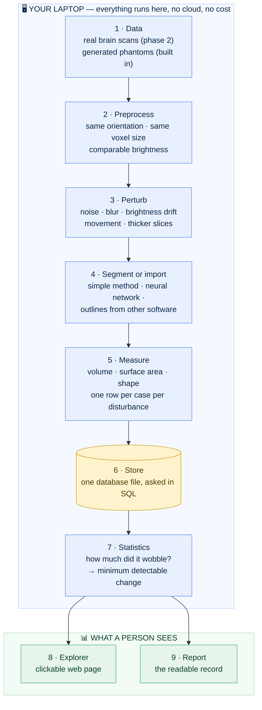

# The Build Guide: StableSeg from day zero to a finished tool

[← README](README.md) · [Glossary](docs/00-glossary.md) · [Architecture](docs/02-architecture.md) · [Roadmap](docs/05-roadmap.md)

**Prerequisites:** none whatsoever. Not programming, not medicine, not
statistics. If you have used a web browser and can type, you can follow this.
**Learning goal:** after working through this document you will have built a
real scientific measurement tool from an empty computer, and you will
understand every part of it — what it does, why it exists, and what would
break if it were missing.
**Time:** roughly eight to twelve weekends, honestly. This is not a
forty-minute tutorial.

---

## How to use this document

**This is the spine, and it is the only document you need to open first.**
Installing, building and understanding all start here. Every other document in
`docs/` is a limb attached to it. Read this one from top to bottom; when it says "now go and read X in
detail", follow the link, do that piece, and come back here.

The reason for the split: a single file containing every command, every
explanation and every troubleshooting table would run to hundreds of pages and
be unusable. Instead, this document holds **the sequence, the reasoning and
the connections** — the narrative — and the linked documents hold **the
detail**. You should never have to guess which document to open, and you
should never have to hunt for why a step exists.

A comparison: this is the recipe for a multi-course dinner, telling you what
to cook, in what order, and why the sauce must be started before the meat
rests. The linked documents are the individual recipe cards.

**Three symbols used throughout:**

| Symbol | Meaning |
|---|---|
| ✅ | Built and working today. You can do this now. |
| ⬜ | Planned. Described here so you know where it fits, but not yet built. |
| 🔗 | Follow the link for the detailed steps, then come back. |

**This document is alive.** It is updated whenever the project changes, and
section 15 explains how to keep it that way. If it ever contradicts the code,
the document is wrong and that is a defect worth fixing immediately.

---

## Contents

**Part I — Understanding**
1. [What you are building, and why anyone would want it](#1-what-you-are-building-and-why-anyone-would-want-it)
2. [The ideas you need first](#2-the-ideas-you-need-first)
3. [How the finished tool is shaped](#3-how-the-finished-tool-is-shaped)

**Part II — Day zero**
4. [Setting up your workshop](#4-setting-up-your-workshop)
5. [Your first run](#5-your-first-run)
6. [Version control: never losing work](#6-version-control-never-losing-work)

**Part III — The build**
7. [Phase 1 — the skeleton ✅](#7-phase-1--the-skeleton-)
7b. [Phase 1b — the R toolchain ✅](#7b-phase-1b--the-r-toolchain-)
7c. [Phase 1c — the first release ✅](#7c-phase-1c--the-first-release-)
8. [Phase 2 — real data ⬜](#8-phase-2--real-data-)
9. [Phase 3 — the perturbation bank ⬜](#9-phase-3--the-perturbation-bank-)
10. [Phase 4 — segment, measure, store ⬜](#10-phase-4--segment-measure-store-)
11. [Phase 5 — the statistics ⬜](#11-phase-5--the-statistics-)
12. [Phase 6 — the deep segmenter ⬜](#12-phase-6--the-deep-segmenter-)
13. [Phase 7 — the explorer ⬜](#13-phase-7--the-explorer-)
14. [Phase 8 — report, release, publish ⬜](#14-phase-8--report-release-publish-)

**Part IV — Keeping it**
15. [Maintaining this document](#15-maintaining-this-document)
16. [The complete map of documents](#16-the-complete-map-of-documents)

---

# Part I — Understanding

## 1. What you are building, and why anyone would want it

### 1.1 Start with a bathroom scale

You want to know whether a diet is working, so you weigh yourself. The scale
says 78.4 kg. Reassuring — it has a decimal point, so it looks precise.

Now step off and step back on. 79.1 kg. Off again, on again: 78.6 kg.

The scale wobbles by about a kilogram between readings, and **you did not
change between readings**. Which means: if you lose half a kilogram this week,
the scale cannot tell you. The measurement's own noise is bigger than the
thing you are trying to see.

That wobble has a name — **repeatability** — and knowing it changes what you
do. It tells you to weigh yourself weekly rather than daily, and not to
celebrate a 300 g drop.

**Almost nobody asks this question of medical measurements. That is the gap
this project fills.**

### 1.2 The same problem, in a hospital

A brain scan is taken. Software traces the outline of the **hippocampus** — a
small curved structure deep in the brain, important for memory, which shrinks
in diseases like Alzheimer's — counts the tiny cubes inside the outline, and
reports a volume in cubic millimetres.

That number is an **imaging biomarker**: a measurement from a picture that
stands in for something about the patient. Drug trials use it. If a treatment
slows the shrinking, the trial should see it in this number.

The effects being hunted are small — a few percent of volume per year.

So: if scanning the same person again next week, on a different machine, with
slightly different settings, shifts the measured volume by five percent, then
a three-percent treatment effect is **invisible**. The trial was doomed before
it enrolled anyone. And teams routinely find this out after the data are in,
which is the worst possible moment.

### 1.3 What StableSeg does about it

It is the software equivalent of stepping on and off the scale two hundred
times.

Take a real scan. Make many copies, each disturbed in a controlled, realistic
way — a bit more noise, slight blurring, a small shift as if the patient
moved, the brightness drift a real scanner produces. **The patient has not
changed. Only the picture has.** Run the same measuring software on every
copy. Look at how much the answers disagree.

That disagreement is the measurement's noise floor. Then convert it into the
number a scientist can actually act on:

> **Minimum detectable change** — the smallest real change that can be told
> apart from measurement noise.

And one step further, into the number that decides a study's design:

> **Required sample size** — how many people you would need in order to detect
> a change of a given size.

### 1.4 Why this is worth building rather than reading about

Three reasons, and the third is the real one.

**It is genuinely useful.** The measuring software is treated as a pluggable
part, so the audit works on anything — a simple method, a neural network, or
outlines exported from other software. It is a tool, not a demonstration.

**It teaches an unusual amount.** Reading files, handling three-dimensional
data, image processing, machine learning, statistics, databases, testing,
version control, publishing. Most projects teach one of those.

**It builds the habit that separates trustworthy work from confident work.**
Asking "how much does my measurement wobble?" before reporting it is a
discipline. This project makes that discipline concrete.

🔗 More on the problem: [`02-architecture.md`](docs/02-architecture.md), section 1.
Every term: [`00-glossary.md`](docs/00-glossary.md).

---

## 2. The ideas you need first

Six ideas. Everything later is built from them. None requires prior knowledge.

### 2.1 A scan is a stack of pictures, and each cube has a size

A photograph is a flat grid of coloured dots called pixels. A medical scan is a
**stack** of such pictures, so it forms a three-dimensional grid of little
cubes. Each cube is a **voxel** — a three-dimensional pixel.

The subtlety that matters more than any other in this project: **a voxel has a
physical size**, recorded in the file. Perhaps 1 mm on each side. Count the
voxels inside a structure, multiply by the volume of one voxel, and you have
the structure's volume in cubic millimetres.

Get that size wrong and every measurement is wrong. A structure of 1,446
voxels is 1,446 mm³ at 1 mm spacing and 11,568 mm³ at 2 mm — an eightfold
error from one overlooked number. This is why the code keeps the numbers and
their physical size welded together and never lets a function separate them.

### 2.2 Segmentation is tracing an outline

**Segmentation** means drawing the boundary of a structure on every slice of
the stack. Like tracing one country on every page of an atlas so you can
measure its area.

The result is a **mask**: a grid the same size as the scan where every voxel
says which structure it belongs to — 0 for background, 1 for the first
structure, 2 for the second.

### 2.3 A phantom is a test object

Hospitals check scanners by scanning a plastic object of known size. You cannot
check a scanner against a person, because nobody knows a person's true
anatomy to the millimetre. The known object is called a **phantom**.

StableSeg generates **digital phantoms**: images created by code, containing
shapes whose exact volume the code knows because it drew them. They let the
automated checks run anywhere in seconds with no download, and they give the
pipeline a known right answer to be checked against.

Like putting a 1 kg calibration weight on a kitchen scale. You do not care
about the weight. You are checking the scale.

**They are synthetic and are not scans of any person.** Every document says so,
and every generated file carries a marker saying so.

### 2.4 A perturbation is a deliberate, realistic disturbance

Each one imitates something that genuinely happens: the patient breathed, the
machine was noisier that day, the slices were thicker, the magnetic field
drifted. Applied one at a time and in combination, they are how a repeat visit
is simulated when no real repeat visit exists in the data.

### 2.5 Reproducibility means the same answer every time

If you delete everything the code produced and run it again, you should get
**byte-for-byte identical results**. On your machine, on mine, in a year.

That is achieved by three habits: never rely on hidden randomness (every random
process is given an explicit starting number, called a **seed**); record the
exact version of every tool used; and record, with every result, what produced
it.

You will see this in practice within your first hour: `stableseg phantom`
prints `mean_true_volume_mm3: 2269.75` on every machine in the world.

### 2.6 Backend, frontend, database

Three words that make software conversations comprehensible. The restaurant
version:

- **Backend** — the kitchen. Everything happening behind the scenes. Customers
  never see it, only its results.
- **Frontend** — the dining room. The part a person looks at and clicks.
- **Database** — the pantry. Organised storage you fetch from precisely,
  questioned with a language called **SQL**, instead of rummaging through bags
  on the floor.

🔗 Every term here, and about eighty more, with an everyday comparison each:
[`00-glossary.md`](docs/00-glossary.md).

---

## 3. How the finished tool is shaped

Nine boxes. Data flows one way, top to bottom, and no step edits its own input.



*(Reading this as plain text rather than a rendered page? Top to bottom: data
feeds preprocessing, which feeds the disturbance bank, which feeds outlining,
which feeds measurement, which fills the store; the statistics read the store
and feed both the explorer and the report.)*

**Why one-way flow matters.** It is what makes reproducibility possible.
Delete everything except the code and the raw inputs, run again, get identical
results. If step 5 could quietly edit step 2's output, that guarantee
evaporates.

**The one design rule that makes it a tool rather than a demonstration.** The
audit sees a segmenter as a single function: *give me a scan, hand me back a
mask*. It does not care what is inside. That is why it can audit a simple
method, a neural network, or another program's output without changing a line.

🔗 Every box explained, with the reasoning:
[`02-architecture.md`](docs/02-architecture.md).

---

# Part II — Day zero

## 4. Setting up your workshop

**Goal:** three tools installed, verified working.
**Time:** about 45 minutes, mostly downloading.

### 4.1 What you are installing, and why each

| Tool | What it is | Why |
|---|---|---|
| **Python** | The programming language everything is written in | Every imaging library worth using is written for it |
| **Git** | A save-game system for a folder of code | Snapshots you can return to; how the work reaches the internet |
| **VS Code** | A text editor built for code | Colours the syntax, catches mistakes, has a terminal built in |

That is all. No database server, no cloud account, no paid anything.

### 4.2 A word about the terminal, before you meet it

A **terminal** is a window where you type commands instead of clicking. It
looks forbidding and is not: you type one line, press Enter, the computer does
one thing and tells you what happened.

Two commands are ninety percent of the skill. `pwd` prints which folder you
are standing in. `ls` (or `dir` on Windows) lists what is in it. That is the
whole of it, honestly.

### 4.3 Which Python version, and why it is not the newest

This project runs on **Python 3.12 or 3.13**, and nothing else. Both bounds
have a specific cause, and the reasoning is worth absorbing because you will
meet it in every project you ever work on:

- **Not 3.11 or older** — because two libraries this project depends on
  (`numpy` and `scipy`) declare that they need 3.12 or newer. The project's own
  code would run fine on 3.11; its dependencies will not install there. **When
  a dependency's floor is higher than yours, theirs wins.**
- **Not 3.14 or newer** — because the imaging libraries have not been verified
  there, and later phases add machine-learning tools that typically trail a new
  Python release by months. Being one version behind the newest is normal and
  deliberate in scientific software.

Which one to install differs by machine, for a reason that catches people out:
Python 3.12 has entered "security fixes only", so python.org no longer
publishes installers for it — only source code. So:

| Your machine | Install | Why |
|---|---|---|
| macOS | Python **3.13** | python.org still ships a macOS installer for it |
| Windows | Python **3.13** | same |
| RHEL 8 | Python **3.12** | what Red Hat packages, and fully supported here |

### 4.4 Install the three tools

🔗 **Open the guide for your machine and follow it top to bottom.** Each one
ends with a verification you must see pass. Do not skip ahead.

| Your machine | Guide |
|---|---|
| Windows 10 or 11 | [`docs/01-setup-windows.md`](docs/01-setup-windows.md) |
| Mac (Intel or Apple Silicon) | [`docs/01-setup-macos.md`](docs/01-setup-macos.md) |
| RHEL 8, Rocky 8, Alma 8 | [`docs/01-setup-rhel8.md`](docs/01-setup-rhel8.md) |

Each explains what a terminal is, installs the three tools with every click
named, and ends with a troubleshooting table of the failures that actually
happen — the unticked PATH box on Windows, the certificate step on macOS,
restricted home directories on RHEL.

**Do not continue until** your guide's final check prints a Python version and
a Git version.

### 4.5 Put the project somewhere sensible

**Not** in OneDrive, Dropbox, iCloud Drive, or (on a Mac with sync switched on)
Desktop or Documents. Those services lock files while syncing and will produce
permission errors at random moments.

```bash
mkdir -p ~/projects
cd ~/projects
git clone https://github.com/akannan2987/stableseg.git
cd stableseg
ls
```
Windows PowerShell — same commands, except `mkdir $HOME\projects -Force`,
`cd $HOME\projects`, and `dir` instead of `ls`.

Expected: `README.md`, `pyproject.toml`, `src`, `tests`, `docs`, `configs`.
If you do not see those, you are in the wrong folder.

### 4.6 Build the private toolbox and install

**macOS / Linux:**
```bash
python3.13 -m venv .venv         # RHEL 8: python3.12
source .venv/bin/activate
python --version                 # must print 3.12.x or 3.13.x
python -m pip install --upgrade pip
python -m pip install -r requirements.lock
python -m pip install -e . --no-deps
```

**Windows (PowerShell):**
```powershell
py -3.13 -m venv .venv
.\.venv\Scripts\Activate.ps1
python --version                 # must print 3.12.x or 3.13.x
python -m pip install --upgrade pip
python -m pip install -r requirements.lock
python -m pip install -e . --no-deps
```

After the activate command your prompt gains a `(.venv)` prefix. **If it is
missing, nothing else will work** — run activate again.

The `python --version` line is the one people skip. If it prints anything
outside 3.12–3.13, stop and fix it now: `deactivate`, delete `.venv`, and
create it again naming the interpreter explicitly. Installing on the wrong
version fails several minutes later with a confusing message.

The `install -r requirements.lock` line downloads about 200 MB and takes two to
five minutes.

### 4.7 The one concept to take away: the private toolbox

You will create a **virtual environment** — a folder holding this project's own
copies of the libraries it needs, isolated from your system and from every
other project. Different projects can then use conflicting versions of the same
library without fighting.

Like a separate toolbox per job, so plumbing tools do not end up mixed into the
electrical kit.

**The rule that saves you hours:** every new terminal window starts *without*
it. Your prompt must show `(.venv)`. If a command fails with "not found",
check that first — it is the cause nine times out of ten.

---

## 5. Your first run

**Goal:** prove the install, produce data, and inspect it. About ten minutes.

With the environment active, in the project folder, run these four:

```bash
pytest -q
stableseg version
stableseg phantom
stableseg describe data/phantom/images/phantom_000.nii.gz
```

Expected, in order: `38 passed`, then `{ "stableseg": "0.1.0" }`, then a block
containing `"mean_true_volume_mm3": 2269.75`, then a description of one file.

Taking the third one on its own:

```bash
stableseg phantom
```

```json
{
  "n_cases": 8,
  "mean_true_volume_mm3": 2269.75,
  ...
}
```

**That number is the checkpoint.** `2269.75` is identical on Windows, macOS
and Linux, on Python 3.12 and 3.13, today and next year — because the generator
is seeded. Seeing it means your setup is not merely working but *reproducing
the reference result exactly*. If you see something else, something in the
numerical stack differs and is worth investigating before trusting anything
downstream.

Look at what it made:

```bash
ls data/phantom/images
```

```
phantom_000.nii.gz  phantom_001.nii.gz  ...
```

Reading the name: `phantom` means generated rather than scanned; `000` is the
case number, zero-padded so case 2 sorts before case 10; `.nii` is NIfTI, the
research format holding a whole 3-D volume plus its voxel size and orientation;
`.gz` means compressed, which tools read without unzipping.

Then inspect one:

```bash
stableseg describe data/phantom/images/phantom_000.nii.gz
```

🔗 Every command, every field of that output explained, and the same operations
done from Python: [`CLI_COOKBOOK.md`](docs/CLI_COOKBOOK.md).

---

## 6. Version control: never losing work

**Goal:** your work exists somewhere other than one laptop. About 20 minutes,
once.

### 6.1 Why bother, in one sentence

Because "I broke it and I do not know what I changed" and "my laptop died" are
both solved problems, and solving them costs twenty minutes once.

### 6.2 The three branches, and why three

A **branch** is a parallel line of snapshots.

| Branch | Role |
|---|---|
| `master` | The released code. Always working. Tags like `v0.1.0` live here. |
| `beta` | A pre-release mirror — somewhere to try a build before tagging it. |
| `develop` | Where every commit is made. **You always work here.** |

For one person this looks like ceremony. The value is that the habit costs
nothing now and scales later: a second contributor can work on `develop` while
`master` stays stable.

### 6.3 The block that ends every phase

Memorise the shape, not the details:

```bash
git switch develop
git add -A
git commit -m "<what changed and why>"
git push origin develop develop:beta develop:master

## --tags is optional, only when required
## then switch back to local master and pull in the remote changes

git switch master
git pull --ff-only origin master
git switch develop
```

`develop:beta` means "send my local `develop` to the remote branch called
`beta`" — which is why you never need a local `beta` branch at all.

🔗 Creating the repository, every command with its expected output, and how to
recover from the two mistakes everyone makes:
[`03-git-workflow.md`](docs/03-git-workflow.md).

### 6.4 The safety check before every push

```bash
python scripts/preflight.py
```

Pushing is easy to undo in principle and hard to undo in practice: once a
commit reaches a public host it has been copied and possibly indexed, and
deleting it later does not recall those copies. A leaked password must be
treated as compromised even if the commit vanishes a minute later.

So this checks, before you push: no credentials, no oversized files, nothing
that should have been excluded, no absolute paths containing your username.

🔗 [`../CONTRIBUTING.md`](CONTRIBUTING.md), section "Before every push",
including how to make Git run it automatically.

---

# Part III — The build

Each phase below follows the same shape: **what you build · why it exists ·
what you will understand afterwards · where the detail lives · how you know it
worked**.

---

## 7. Phase 1 — the skeleton ✅

**Status: built.** This is what exists today.

### What it is

The frame everything else hangs on. Nothing here measures a hippocampus.

- An installable **package**, so the code can be imported from anywhere
- A **settings file** format, so one run is described by one file
- A **storage layer**, so results have one home and a record of what made them
- **File loading** that never separates the numbers from their physical size
- A **phantom generator**, so tests need no download
- A **command-line tool** and a **function layer** underneath it
- **38 automated checks**, running in under a second
- **Automated verification** on six platform combinations, on every push

### Why this first, and not the interesting part

Everyone's instinct is to build the neural network first. It would have been a
mistake, and understanding why is worth more than the code.

Every later phase writes through the storage layer, is described by the
settings format, and is driven through the function layer. Build those first
and no phase needs rewriting when the next arrives. Build them last and you
rewrite everything twice.

The house version: the instinct is to choose the kitchen worktop, because that
is the part you can picture. But the foundation and the frame come first, and
each constrains the next.

### What you will understand afterwards

What a package is and why the code sits in `src/`. What a settings file buys
you. Why a storage abstraction exists. How a file keeps its geometry. How a
seeded generator produces identical data everywhere. What a test is. What
automated verification does on every push.

### 🔗 The detail

[`04-phase-tutorials/phase-01-skeleton.md`](docs/04-phase-tutorials/phase-01-skeleton.md)
— three sessions of about forty minutes, every file explained, with a
"what could go wrong" table.

### How you know it worked

```bash
pytest -q                        # 38 passed
stableseg phantom                # mean_true_volume_mm3: 2269.75
python scripts/preflight.py      # Clear to commit and push.
```

### Commit it

```bash
git switch develop
git add -A
git commit -m "phase 1: skeleton, config, storage, file loading, phantom generator, tool, tests, checks"
git push origin develop develop:beta develop:master

## --tags is optional, only when required
## then switch back to local master and pull in the remote changes

git switch master
git pull --ff-only origin master
git switch develop
```

---

## 7b. Phase 1b — the R toolchain ✅

**Status: built.** Short — about thirty minutes — and optional, but worth doing
now rather than later.

### What it is

One R script, `R/verify_setup.R`, that reads the phantom manifest the Python
side produced, prints a summary, and recomputes one number that Python also
computed.

### Why now, when R is not needed until phase 5

Because there is no worse moment to discover that R will not install on your
machine than the moment you need it for real statistical work.

R enters this project at phase 5 for one specific job: computing the agreement
statistics a **second time**, independently, using the established R packages —
and checking that the two implementations agree to four decimal places. Two
unrelated implementations arriving at the same number is a far stronger check
on a formula than one careful implementation. Most projects never do this.

That check is only worth planning if the toolchain works. So it gets verified
early, on a task with a known right answer.

The everyday version: before trusting a second set of scales to check the
first, you put a known weight on it. That is exactly what this script does.

### Why it uses no R packages at all

Deliberate. A first-run script that needs a package download is a first-run
script that fails behind a corporate proxy, on a locked-down machine, or on a
bad connection. `verify_setup.R` uses only what ships with R. Package
management — with `renv`, R's equivalent of the Python lock file — arrives at
phase 5, when there is a real reason for it.

### 🔗 The detail

[`docs/01-setup-r.md`](docs/01-setup-r.md) — installing R and RStudio on
Windows, macOS and RHEL 8, what each is, running the script both ways, and what
to do when it fails.

The repository also carries `stableseg.Rproj`, RStudio's project file. Opening
it sets the working directory to the project root, so scripts find their data
without anyone remembering to set it. It also switches off RStudio's habit of
saving your variables between sessions — convenient, and quietly fatal to
reproducibility, because a script can appear to work on leftovers from an hour
ago and then fail for everyone else.

VS Code and RStudio can both be open on this project at once: VS Code for the
Python, RStudio for the R. They are ordinary editors reading the same folder
and do not conflict.

### How you know it worked

```bash
Rscript R/verify_setup.R
```

The last two lines:

```
  mean total volume computed in R: 2269.75 mm3
  value published by the Python tool: 2269.75 mm3
  -> match

R toolchain verified.
```

Two languages, two implementations, one number. That is the shape of every
cross-check this project will make.

### Commit it

```bash
git switch develop
git add -A
git commit -m "phase 1b: R toolchain verification script and setup guide"
git push origin develop develop:beta develop:master

## --tags is optional, only when required
## then switch back to local master and pull in the remote changes

git switch master
git pull --ff-only origin master
git switch develop
```

---

## 7c. Phase 1c — the first release ✅

**Status: done.** Version 0.1.0 is tagged and published — and so is v0.1.1,
released the same day, which is itself part of the lesson (below).

### What it is

A **release**: this exact state of the project, frozen under the name
`v0.1.0`, installable and citable forever, regardless of what changes
afterwards. The everyday version: the project is a document you keep editing;
a release is printing a copy, writing "edition 1" on the cover, and putting it
on the shelf.

### Why release something this early

Because 0.1.0 is a clean, describable boundary — *the skeleton, complete and
documented, before real data arrives* — and phase 2 changes the project's
shape. Without a tag, this state would only be reconstructable by digging
through commit history. With one, anyone can install it with a single command
and reproduce the reference number against it.

It is also the cheapest possible rehearsal of a professional habit. Releasing
badly is easy; the tutorial below is mostly a checklist of the small things
that make a release trustworthy: version strings that provably agree, a
changelog written as you went rather than reconstructed, green checks before
tagging, and — the step almost everyone skips — installing the release into a
clean environment to prove the claim it makes.

### What you will understand afterwards

What a tag is and how it differs from a branch. What the three numbers in a
version promise, and why staying at `0.x` is itself a statement. What a GitHub
Release adds on top of a tag. Why a published tag is never deleted, only
superseded.

### 🔗 The detail

[`docs/04-phase-tutorials/phase-01c-first-release.md`](docs/04-phase-tutorials/phase-01c-first-release.md)
— the five-point pre-release checklist, the exact commands with expected
output, the GitHub Release steps, and the install-from-tag verification.

### How you know it worked

```bash
git tag                    # lists: v0.1.0, v0.1.1
```

And from any machine anywhere:

```bash
pip install "git+https://github.com/akannan2987/stableseg.git@v0.1.1"
stableseg phantom          # ends with: "mean_true_volume_mm3": 2269.75
```

### What actually happened, honestly

The verification step caught a real bug. Installing `v0.1.0` into a clean
environment and running `stableseg phantom` failed: the command's default
configuration pointed at a file that exists in a project checkout and nowhere
else. Every test had passed, because every test ran inside the checkout.

Per the tutorial's own rule — a published tag is never deleted — `v0.1.0`
stands as released, and `v0.1.1` fixes the defect, adds regression tests that
run the command from an empty folder the way an installed user would, and
records the story. The install-from-tag check was the only check standing
outside the project, and it caught what everything inside could not see. That
is why it is in the checklist.

### Commit it

The git block for this phase is the one time `--tags` is required; it is
spelled out at the end of the
[release tutorial](docs/04-phase-tutorials/phase-01c-first-release.md).

---

## 8. Phase 2 — real data ⬜

### What it is

The first real scans arrive: the **Medical Segmentation Decathlon hippocampus
set** — 394 real brain scans, 263 with outlines drawn by experts, about 36 MB,
freely licensed, no account needed.

Plus a reader for **DICOM**, the format hospitals actually use — one file per
slice, with extensive information in each file's header. Tested against a small
series generated by code, so hospital-format support is demonstrated **without
any patient data**.

### Why now, and why this dataset

You cannot write a realistic disturbance without a real image to disturb. A
noise level that looks plausible on a generated ellipsoid may be absurd on an
actual brain.

This dataset specifically because the volumes are tiny — roughly 35 × 50 × 35
voxels — so everything trains and runs on an ordinary processor in minutes. And
because hippocampal volume is a *real* trial endpoint, so the question the
project asks is real rather than invented.

### What you will understand afterwards

How real scans differ from generated ones. Why orientation and voxel spacing
must be handled explicitly. The difference between the research format and the
hospital format, and why both exist. How to test a reader for a format you
have no legal data for.

### How you will know it worked

`stableseg describe` on a real scan reports sensible dimensions and spacing,
and the outline volumes fall in the range published for hippocampal volume.

---

## 9. Phase 3 — the perturbation bank ⬜

### What it is

The heart of the project. Named, adjustable disturbances organised by
**modality profile** — because different scanner types fail differently. For
MRI: added noise, blurring, brightness scaling, smooth intensity drift, small
rotation and shift, thicker slices. Each documented with the real-world cause
it imitates.

### Why before the segmenter, which is the surprising order

The obvious order is "build the model, then test it". But the disturbance bank
is the *contribution*, and the segmenter is a component it consumes. Building
the bank first forces the segmenter to be pluggable from the start. Build it
the other way round and the audit ends up welded to one particular model —
precisely the thing it must not be.

### What you will understand afterwards

How images are manipulated mathematically. Why each disturbance corresponds to
a physical cause. How to make randomness reproducible so an experiment can be
repeated exactly.

---

## 10. Phase 4 — segment, measure, store ⬜

### What it is

Preprocessing, then a **simple segmenter** — brightness threshold plus shape
tidying, about fifty lines, no training — then measurement (volume, surface
area, shape), then everything written into a **database**.

### Why a simple method before a neural network

Two reasons, both important.

The whole pipeline runs end to end weeks before any model exists, and **a
pipeline you can run is a pipeline you can debug**.

And it is the honest comparison: a neural network that cannot beat brightness
thresholding on this task has not earned its complexity. Most projects never
check, and quietly assume.

### What you will understand afterwards

Classical image processing. What preprocessing does and why. What a database is
and why one file beats a folder of spreadsheets. **How to ask questions in
SQL** — including multi-line queries with `WITH` clauses, which is how real
analytical questions are actually written.

### 🔗 Where SQL will be taught

`docs/QUERY_COOKBOOK.md` arrives with this phase: tested, explained queries
against the results database, from a first `SELECT` to multi-part questions
like *"which disturbance moved the measurement most, averaged across cases,
excluding those that failed quality control"*. Same convention as the sibling
projects.

---

## 11. Phase 5 — the statistics ⬜

### What it is

The verdict. The agreement statistics, each written out explicitly and checked
against a worked example: **intraclass correlation**, **within-subject
coefficient of variation**, **Bland–Altman limits**, **repeatability
coefficient**, **minimum detectable change**, and confidence intervals. Then
the sample-size calculator.

### Why this is the hard phase, honestly

Not because the formulas are difficult — they are arithmetic. Because getting
the **experimental design** right is subtle. Which cases count as independent?
What exactly is being repeated? Those questions decide whether the numbers mean
anything, and no library answers them for you.

This is where you slow down and think.

### Where R and RStudio come in

**R** is a programming language built by statisticians for statistics. This
project is written in Python because that is where the imaging tools are — but
R is the right tool for one specific job here: **independently checking the
statistics**.

The agreement statistics have mature, peer-reviewed R packages (`irr`, `psych`,
`blandr`). So the same numbers get computed twice, by two unrelated
implementations, and **must agree to four decimal places**.

If they agree, the formula is almost certainly right. If they diverge, one is
wrong and you need to find out which — which is a far stronger check than
either implementation alone. Most projects never do this.

What it needs: an `R/` folder, **RStudio** as the editor (it works on Windows,
macOS and RHEL 8), and `renv` to record exact R package versions the same way
the lock file does for Python. The R side stays optional, so the project runs
Python-only for anyone who does not want it.

This is also the natural place to use **R Markdown or Quarto** for statistical
write-ups, since Quarto renders R and Python in the same document.

### What you will understand afterwards

What each statistic actually measures and when each is the right one. Why a
correlation alone hides errors that depend on size. How measurement error
converts into study design. Why two independent implementations are worth more
than one careful one.

---

## 12. Phase 6 — the deep segmenter ⬜

### What it is

A **3D U-Net** — the standard neural-network design for medical outlining,
named for its U shape — trained with **MONAI**, the medical imaging toolkit.
Plus physics-grade artefacts: simulated patient movement, ghosting, magnetic
field distortion.

Both arrive as an **optional add-on**, so the audit still installs and runs
without them.

### Why optional, deliberately

Because the audit must not depend on any one segmenter — that is the entire
design. Also practical: it keeps the automated checks fast, and keeps the tool
usable on a laptop with no graphics card.

### The question this phase finally allows

Does the modern model produce a **more stable** measurement, not merely a more
accurate one? That is what the whole project exists to ask, and it cannot be
asked until both a simple and a sophisticated segmenter exist side by side.

---

## 13. Phase 7 — the explorer ⬜

### What it is

A web page built with **Streamlit**, which turns a Python script into an
interactive page with no web code at all. Pick a disturbance, watch the
measurement distribution move, see which cases are unreliable, use the
sample-size calculator.

Likely also a read-only SQL console, as the sibling project has — so a curious
user can ask their own questions of the results rather than only the ones you
anticipated.

### Why not until now

The page displays the statistics. Build it first and you are guessing what it
will display, then rebuilding. More subtly: if the statistics say something
unexpected, the page's whole shape changes. Let the answer decide the
interface.

### 🔗 Getting it online

[`HOSTING.md`](docs/HOSTING.md) — free options compared, and the one design decision
that keeps it inside a free tier's memory limits.

---

## 14. Phase 8 — report, release, publish ⬜

### What it is

A document that **regenerates itself** from the database — methods, figures,
tables, the minimum detectable change, and the honest limitations — built with
**Quarto**, which weaves text, code and the code's output into one polished
file. Then the `1.0` release.

### Why a report as well as a page

A dashboard is a place to look around. A report is a **record** — something a
person can read, file, and return to. Real measurement work runs on periodic
reports, not on dashboards alone.

### The limitations that must be stated

Three, and stating them plainly is what makes the rest credible:

1. The phantoms are **synthetic**.
2. The repeat scans are **simulated**, not second visits — the disturbances are
   realistic and documented, but they are not a person returning next week.
3. A model trained on a few hundred cases demonstrates **workflow competence,
   not clinical performance**.

🔗 The publishing checklist: [`HOSTING.md`](docs/HOSTING.md), section 6.

---

# Part IV — Keeping it

## 15. Maintaining this document

**This document is alive.** It describes a project that is still being built,
and it is only useful if it stays true.

### The rule

> When a phase is completed, its section here changes from ⬜ to ✅ **in the
> same commit** as the code. Not later.

Not "before the next release" — the same commit. A document updated later is a
document that gets forgotten, and one wrong entry teaches a reader to distrust
all the others.

### What to update, and when

| When this happens | Update here |
|---|---|
| A phase is finished | ⬜ → ✅, add the link to its tutorial and its verification commands |
| A new document is added | Section 16, and a 🔗 link from the relevant phase |
| The setup changes (a version, a tool) | Section 4 |
| A phase turns out harder or easier than described | Say so. An honest estimate beats an encouraging one |
| The order of phases changes | Reorder here **and** in [`05-roadmap.md`](docs/05-roadmap.md), and say why in both |

### The rule about detail

**Detail lives in the linked document, not here.** If you find yourself adding
a troubleshooting table or a long code listing to this file, it belongs
somewhere else with a link from here. This document holds the sequence, the
reasoning and the connections. Let it swell with detail and it stops being
usable as a spine.

### Committing an update

```bash
git switch develop
git add -A
git commit -m "docs: update build guide for phase N"
git push origin develop develop:beta develop:master

## --tags is optional, only when required
## then switch back to local master and pull in the remote changes

git switch master
git pull --ff-only origin master
git switch develop
```

---

## 16. The complete map of documents

Which document to open, and when.

### Start here, in this order

| # | Document | Read it when |
|---|---|---|
| 1 | **This document** (`BUILD_GUIDE.md`) | **First, and throughout.** Installing, building, and understanding why — the whole journey in one place |
| 2 | [`docs/00-glossary.md`](docs/00-glossary.md) | Continuously. Keep it open beside everything else |
| 3 | Setup: [Windows](docs/01-setup-windows.md) · [macOS](docs/01-setup-macos.md) · [RHEL 8](docs/01-setup-rhel8.md) | Day zero, once per machine — sent here from section 4 |
| 4 | [`docs/02-architecture.md`](docs/02-architecture.md) | When you want every box explained rather than summarised |
| 5 | [`docs/03-git-workflow.md`](docs/03-git-workflow.md) | When you are ready to publish |

### While building

| Document | What it holds |
|---|---|
| [`04-phase-tutorials/`](docs/04-phase-tutorials/) | One file per phase: exact steps, code, checkpoints, what could go wrong |
| [`CLI_COOKBOOK.md`](docs/CLI_COOKBOOK.md) | Every command with its real pasted output; the same things from Python |
| [`../CONTRIBUTING.md`](CONTRIBUTING.md) | Branch model, release procedure, the pre-push safety check, review norms |
| `QUERY_COOKBOOK.md` ⬜ | Tested SQL against the results database (arrives with phase 4) |

### Looking further ahead

| Document | What it holds |
|---|---|
| [`05-roadmap.md`](docs/05-roadmap.md) | What comes next, in order, and the dependency reasoning |
| [`06-product-and-technology-roadmap.md`](docs/06-product-and-technology-roadmap.md) | Nineteen technologies judged — verdict and the trigger that would change each |
| [`HOSTING.md`](docs/HOSTING.md) | Every route onto the internet, compared |

### Reference

| Document | What it holds |
|---|---|
| [`../README.md`](README.md) | The front door: what, why, status, structure |
| [`../CHANGELOG.md`](CHANGELOG.md) | What changed in each released version |
| [`UNINSTALL.md`](docs/UNINSTALL.md) | Removing any part, or all of it, safely |

---

## Where you are now

Phase 1 is built. Six of eight phases remain, and the honest estimate is eight
to twelve weekends.

If you have followed Part II, you have a working scientific tool on your
machine, published to the internet, with automated verification on three
operating systems — which is further than most software projects ever get, and
you have not yet written a line of the science.

That was the point of doing it in that order.

**Next:** [`04-phase-tutorials/phase-01-skeleton.md`](docs/04-phase-tutorials/phase-01-skeleton.md)
if you have not worked through phase 1 in detail, or
[`05-roadmap.md`](docs/05-roadmap.md) if you want the reasoning behind what comes
after.
