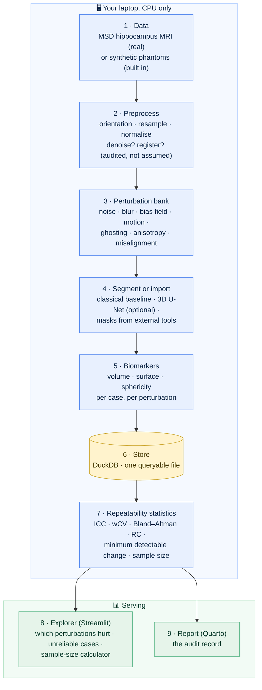
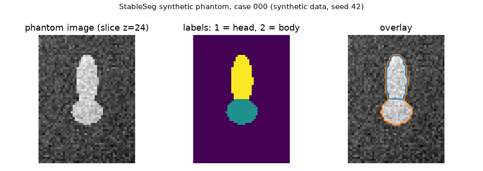

# StableSeg 🧠🔬📏🔁

<!-- Cover image goes here once the explorer exists:
[](docs/img/cover_stableseg.png) -->

**▶ Live explorer — coming with the app phase** · **v0.1.1** · [Release notes](CHANGELOG.md)
· 


**How much does a number measured from a medical scan move when the patient
has not changed at all? StableSeg measures that, for segmentation-based
imaging biomarkers, and reports it in the language a clinical trial needs.**

### ▶ New here? Open [**`BUILD_GUIDE.md`**](BUILD_GUIDE.md).

One document, start to finish: what this project is and why anyone would want
it, the ideas you need first, installing from a blank machine in about 45
minutes, then every build phase in order with the reasoning behind that order —
linking out to the detailed guide for each step. It is kept current as the
project changes.

**If you read one thing, read that.** This page is the summary.

> Every term used anywhere in this repo, medical or technical, is defined in
> plain language in [`docs/00-glossary.md`](docs/00-glossary.md). If a word
> isn't there, that's a documentation bug.

---

## Contents

- [**BUILD GUIDE — the whole project, start here**](BUILD_GUIDE.md)
- [What is an imaging biomarker?](#what-is-an-imaging-biomarker-start-here)
- [The problem this project tackles](#the-problem-this-project-tackles)
- [How it works](#how-it-works)
- [The data at a glance](#the-data-at-a-glance)
- [Results, phase by phase](#results-phase-by-phase)
- [Build log](#build-log)
- [**The tutorial, in order**](#the-tutorial-in-order)
- [Roadmap](#roadmap)
- [About the data (honesty notes)](#about-the-data-honesty-notes)
- [Repository map](#repository-map)
- [How to run](#how-to-run)
- [How I work on this repo (branch model)](#how-i-work-on-this-repo-branch-model)
- [Why the documentation is so detailed](#why-the-documentation-is-so-detailed)
- [License](#license)

## One question, two imaging worlds

StableSeg asks one question: **how much does an imaging biomarker move when
the patient has not changed?** It asks it on two equal tracks that share one
statistical spine:

| | 🧠 **Track V — volumetric radiology** | 🔬 **Track P — digital pathology** |
|---|---|---|
| The picture | MRI / CT volumes, 3-D, millimetres | H&E · IHC · multiplex-immunofluorescence tiles and whole-slide images; spatial-transcriptomics spots, 2-D, microns |
| The biomarker | volume, surface, shape of a traced structure | tissue fractions, cell densities per phenotype, IHC positivity, spatial statistics, cell-graph scores, foundation-model embeddings |
| The disturbances | noise, blur, field drift, motion, slice thickness | stain shift, scanner colour response, compression, focus, magnification, folds |
| Real test–retest? | simulated (stated everywhere) | **yes** — the same tissue under 7 scanners × 13 stains ([data card](docs/data-cards/plism.md)) |
| Status | foundation released (v0.1.1) | designed and documented; first code (the H&E phantom) is the next phase |

Both feed the same statistics — ICC, within-subject CV, Bland–Altman,
repeatability coefficient, **minimum detectable change**, **sample size** —
the same store, the same explorer and the same report. Every release ships a
comparable increment on both tracks. The reasoning is in
[`docs/05-roadmap.md`](docs/05-roadmap.md), section 3.

## What is an imaging biomarker? (start here)

Think of a bathroom scale. It gives you a number, and you make decisions on
it: the diet is working, or it isn't. Medicine does the same with scans. A
computer traces the outline of a structure on every slice of an MRI (that
tracing is called **segmentation**), counts the voxels inside (a voxel is a
3-D pixel), multiplies by the voxel size, and reports a volume in cubic
millimetres. That number is an **imaging biomarker**: a measurement from an
image that stands in for something about the patient.

The structure this project starts with is the **hippocampus**, a small,
curved region deep in the brain involved in memory. It shrinks in
neurodegenerative disease, and its volume measured from MRI is used as an
endpoint in clinical trials: if a drug slows the shrinking, the trial can see
it in this number.

Now the question nobody asks about the scale until it matters: **if you step
off and step back on, do you get the same number?** If the scale wobbles by
two kilograms between readings, a one-kilogram loss is invisible. In imaging,
"stepping back on" means the same patient scanned on another day, another
scanner, with slightly different settings, and the software reading a
slightly different picture. StableSeg is the tool that stands on the scale a
few hundred times and tells you how much it wobbles.

## The problem this project tackles

**The pain point.** Segmentation models are reported with an accuracy score
(Dice) that says how well they match a human tracing on one scan. It says
nothing about whether the number is *stable* across scanners, protocols and
days. Trials in neurodegeneration hunt for treatment effects of a few percent
of volume per year. If re-scanning alone shifts the measured volume by five
percent, a three-percent effect can never be seen, and the trial was lost
before it started. Teams usually discover this after the data are in.

**Why it matters.** A biomarker is only useful if a change in the number means
a change in the patient. Knowing the measurement's own noise floor, before
trusting it, is what separates a number you can act on from a number that
looks precise. The engineering world does this routinely for physical
instruments (gauge repeatability studies); the imaging world has the
vocabulary for it (the Quantitative Imaging Biomarkers Alliance publishes it)
but few open, beginner-reproducible examples of actually doing it for a
deep-learning pipeline.

**What StableSeg is.** A measurement-system audit for segmentation-based
biomarkers. It takes a segmentation pipeline (a classical baseline, a trained
3D U-Net, or masks imported from any external tool), applies a bank of
controlled, realistic acquisition perturbations to real hippocampal MRI
(noise, blur, intensity drift, bias field, motion, ghosting, resolution
change, small misalignment), re-runs the pipeline on every perturbed copy,
and reports the biomarker's repeatability as intraclass correlation,
within-subject coefficient of variation, Bland–Altman limits, the
repeatability coefficient, and the **minimum detectable change**: the
smallest real change that can be told apart from measurement noise. A
sample-size calculator turns that number into a study-design answer. Every
step is documented so a complete beginner can rebuild and understand it:
**the repository is the tutorial.**

## How it works



In words: load a scan, make many realistic variants of it, segment every
variant with the same pipeline, measure the biomarker on each, and look at
how much the measurements disagree with each other for the same patient.
That disagreement is the measurement noise. The statistics turn it into a
number a trialist can use.

Design rule that shapes everything: **the audit engine must run with
NumPy, SciPy, scikit-image and SimpleITK alone.** PyTorch, MONAI and TorchIO
are an optional extra (`pip install "stableseg[deep]"`). The audit is
independent of any one segmenter, so it can judge them all.

Full walkthrough: [`docs/02-architecture.md`](docs/02-architecture.md).

## The data at a glance

| Source | What | Status |
|---|---|---|
| **Synthetic [phantoms](docs/00-glossary.md#part-1--the-subject-images-measurement-statistics)** (built in) | Two-part ellipsoid structures in noisy, slightly uneven "tissue"; known true volumes; fixed seed; ~48×64×48 voxels. Generated by `src/stableseg/phantom.py`. **Synthetic, and labelled as such everywhere.** | ✅ v0.1.0 |
| **Medical Segmentation Decathlon, Task 04 (Hippocampus)** · [card](docs/data-cards/msd-hippocampus.md) | 394 real T1 MRI volumes, 263 with expert labels (two parts: head and body), about 36 MB, CC-BY-SA 4.0, no account needed. Tiny volumes, so everything runs on a CPU. | ⬜ phase V2 |
| **Synthetic H&E / IHC / mIF phantoms** (Track P, built in) | Nuclei as ellipses coloured through the hematoxylin/eosin optical-density model; known counts, positions, positive fraction and phenotype proportions. `src/stableseg/pathology/phantom.py`. **Synthetic, labelled as such.** | ⬜ phase P1a / P1 |
| **PLISM** · [card](docs/data-cards/plism.md) | The same tissue under 7 scanners × 13 H&E stain conditions, registered; 512 px tiles at 40×; CC BY 4.0; streamed, not downloaded whole. **The real test–retest.** | ⬜ phase P2 |
| **Canine multi-scanner SCC** · [card](docs/data-cards/canine-multiscanner-scc.md) | 44 sections × 5 scanners, pyramidal TIFF at 4 µm/px; CC BY 4.0. Whole-slide streaming demo; tissue-level scanner variation. | ⬜ phase P1 |
| **NCT-CRC-HE** · [card](docs/data-cards/nct-crc-he.md) | Colorectal tiles, 9 tissue classes, 224 px at 0.5 µm/px; CC BY 4.0; the un-normalised variant keeps real stain variation. | ⬜ phase P1 |
| **PanNuke** · [card](docs/data-cards/pannuke.md) | 7,901 tiles with every nucleus outlined and classed; **CC BY-NC-SA 4.0, non-commercial**. | ⬜ phase P3 |
| **BCI** · [card](docs/data-cards/bci.md) | 4,873 registered H&E ↔ HER2-IHC pairs; **non-commercial research**. | ⬜ phase P3 / P6 |




*How the simulated repeat scans will work (illustration — phase 3 builds these
properly): the same slice, disturbed the way real scanning disturbs a picture.
The patient has not changed; only the picture has.*

*Phantom case 000 at v0.1.0: image, labels, overlay. **Not a real scan** — a
digital phantom is a generated image with a known true volume, used to check
the pipeline the way a 1 kg calibration weight checks a scale. See
[what a phantom is](docs/00-glossary.md) and
[how they are generated](docs/04-phase-tutorials/phase-01-skeleton.md).*

## Results, phase by phase

*Each phase leaves a visible artefact. One figure per phase appears here with
what it means. Nothing is shown before it exists.*

- **Phase 1 — Skeleton:** ✅ an installable package with a strict layering
  rule (`cli → api → core`), a validated config format, a storage
  abstraction with provenance stamps, geometry-preserving NIfTI I/O, the
  first biomarker (label volume in mm³), a deterministic phantom generator,
  a 4-command CLI, 38 tests that run in under a second with no download, and
  CI on three operating systems. The figure above is its output.
- **Phase 1b — R toolchain:** ✅ a dependency-free R script that reads the
  generated manifest and recomputes a value the Python side published — 2269.75
  from both, independently. Verifies R installs and runs on all three systems
  before the statistics phase depends on it.
- **Phase 2 — Real data:** *(pending)* the hippocampus MRI lands, with a
  DICOM reader tested on a synthetic series.
- **Phase 3 — Perturbation bank:** *(pending)*
- **Phase 4 — Segment and measure:** *(pending)*
- **Phase 5 — Repeatability statistics:** *(pending)*
- **Phase 6 — Deep segmenter:** *(pending)*
- **Phase 7 — Explorer:** *(pending)*
- **Phase 8 — Report and packaging:** *(pending)*

## Build log

| Phase | Guide | Status |
|---|---|---|
| — | [Build guide — the whole journey, day zero to finished](BUILD_GUIDE.md) | 🔨 living document |
| — | [Glossary — every term in plain words](docs/00-glossary.md) | 🔨 living document |
| 0 | [**Setup — Windows**](docs/01-setup-windows.md) · [**macOS**](docs/01-setup-macos.md) · [**RHEL 8**](docs/01-setup-rhel8.md) | ✅ |
| 1b | [R toolchain check + R/RStudio setup](docs/01-setup-r.md) | ✅ |
| 1c | [First release: tagging v0.1.0](docs/04-phase-tutorials/phase-01c-first-release.md) | ✅ |
| 0 | [Architecture — how it all fits together](docs/02-architecture.md) | ✅ |
| 0 | [Git workflow — master / beta / develop](docs/03-git-workflow.md) | ✅ |
| 1 | [Skeleton: package, config, storage, phantoms, CLI, tests, CI](docs/04-phase-tutorials/phase-01-skeleton.md) | ✅ |
| P1a | Synthetic H&E phantom — Track P's first code | ⬜ next |
| V2 | Real data: MSD hippocampus + DICOM reader | ⬜ planned |
| P1 | Pathology data & I/O: geometry base, WSI/OME-TIFF/AnnData readers, IHC + mIF phantoms, data cards, streamed slide | ⬜ planned |
| V3 | MRI perturbation bank (NumPy/SciPy) | ⬜ planned |
| P2 | Pathology perturbation bank, validated on PLISM | ⬜ planned |
| V4 | Segment (classical) and measure (biomarkers) → DuckDB | ⬜ planned |
| P3 | Tissue seg · nucleus detection · IHC positivity · mIF phenotyping · spatial statistics · cell graphs → DuckDB | ⬜ planned |
| S1 | Repeatability statistics + R cross-check, once for both tracks · **0.2.0** | ⬜ planned |
| V6 | Deep segmenter (MONAI 3D U-Net) + TorchIO artefacts | ⬜ planned |
| P4 | Foundation-model embeddings + benchmark harness (`benchmarks/`) | ⬜ planned |
| P5 | Cell-graph network (PyTorch Geometric) | ⬜ planned |
| P6 | Multimodal: H&E ↔ IHC, H&E ↔ spatial-transcriptomics spots | ⬜ planned |
| P7 | Stain normalisation, classical vs learned; synthetic tiles | ⬜ planned |
| S2 | The explorer (Streamlit) with modality switch + sample-size calculator | ⬜ planned |
| S3 | Report (Quarto, both tracks), publication package, container · **0.3.0** | ⬜ planned |
| — | [Roadmap](docs/05-roadmap.md) · [Product and technology roadmap](docs/06-product-and-technology-roadmap.md) | ✅ |
| — | [CLI cookbook](docs/CLI_COOKBOOK.md) · [Hosting](docs/HOSTING.md) · [Uninstall](docs/UNINSTALL.md) | ✅ |

## The tutorial, in order

Everything is taught in `docs/`, written for a complete beginner, with every
term defined and every command shown with its expected output.

| # | Document | What you learn |
|---|---|---|
| — | [**Build guide**](BUILD_GUIDE.md) | **The spine — start here.** Day zero to finished tool: installing, every phase, the reasoning, and where each detail lives |
| 00 | [Glossary](docs/00-glossary.md) | Every term, plain language, with an everyday analogy |
| 01 | [Setup: Windows](docs/01-setup-windows.md) / [macOS](docs/01-setup-macos.md) / [RHEL 8](docs/01-setup-rhel8.md) | Blank machine → working workshop: Python, Git, a virtual environment, the verification habit |
| 01 | [Setup: R and RStudio](docs/01-setup-r.md) | Optional. Why a Python project uses R, and the toolchain check |
| 02 | [Architecture](docs/02-architecture.md) | Backend / frontend / database in plain words; the nine boxes and why each exists |
| 03 | [Git workflow](docs/03-git-workflow.md) | Save-game for code; the `master`/`beta`/`develop` model step by step |
| 04 | [Phase tutorials](docs/04-phase-tutorials/) | One file per build phase: goal, why, exact steps, checkpoint, what could go wrong, git block |
| 05 | [Roadmap](docs/05-roadmap.md) | What comes after 0.1.0, in order, and why that order |
| 06 | [Product and technology roadmap](docs/06-product-and-technology-roadmap.md) | From a laptop tool to a hosted product: nineteen technologies judged, with verdicts and triggers |
| — | [Uninstall](docs/UNINSTALL.md) | Removing any part, or all of it, cleanly and safely |
| — | [Hosting](docs/HOSTING.md) | Every way to put the explorer and report online, compared |
| — | [Data cards](docs/data-cards/README.md) | One page per dataset on either track: source, licence, size, use, and what it cannot show |
| — | [CLI cookbook](docs/CLI_COOKBOOK.md) | Tested, explained commands — grows every phase |

## Roadmap

The short version; the reasoned version, with the dependency order explained, is
[`docs/05-roadmap.md`](docs/05-roadmap.md).

- **0.2.0 — the audit runs on both tracks.** Track V: real MRI + DICOM, the
  MRI perturbation bank, classical segmenter, volume biomarkers. Track P:
  pathology data and I/O, the pathology perturbation bank validated on PLISM,
  tissue and nucleus segmentation, IHC positivity, mIF phenotyping, spatial
  statistics, cell graphs. Shared: the DuckDB store, the repeatability
  statistics with the R cross-check, the SQL cookbook, a CT profile, a
  container. Pre-release tags on `beta` along the way.
- **0.3.0 — the modern layer on both tracks.** Track V: MONAI 3D U-Net,
  TorchIO artefacts. Track P: foundation-model embeddings and the stability
  benchmark harness, a cell-graph network, multimodal H&E↔IHC and
  H&E↔spatial-transcriptomics components, stain normalisation classical vs
  learned. Shared: the explorer with a modality switch, the Quarto report,
  the publication package, import adapters.
- **0.4.0** tool server exposing the audit to other programs, language-model
  narration of the report grounded in computed numbers, gated foundation
  models and foundation-model segmenters as plug-ins, real test–retest MRI,
  clinical-covariate joins, further modality profiles, coded findings.

## About the data (honesty notes)

- The **phantoms are synthetic**. They exist so the tests run anywhere and so
  the pipeline can be checked against a known truth. They are not scans and
  are labelled `synthetic: true` in every file that contains them.
- The **MSD hippocampus data are real** de-identified MRI, but they contain
  **no repeat scans of the same person**. StableSeg's audit is therefore a
  *simulated* test–retest: the perturbations are realistic and documented, but
  they are not a second visit. That limitation is stated in every report the
  tool produces.
- Any model trained here on a few hundred hippocampi or tiles demonstrates
  workflow competence, not clinical performance.
- On Track P, **PLISM is a real test–retest** (the same tissue under many
  scanners and stains) and is described as such; the canine multi-scanner set
  is real test–retest **at tissue level only**, because its resolution is too
  low for nuclei. Every dataset's limits are on its
  [data card](docs/data-cards/README.md).
- **Non-commercial licences are stated**, not buried: PanNuke and BCI restrict
  commercial use; Phikon-v2 carries a non-commercial licence; Cellpose's code
  is free but its weights were trained on non-commercially licensed data.
  Anything derived from them inherits the restriction and is marked.
- The pathology foundation models are **audited here, not trained here**.

## Repository map

```
stableseg/
├── BUILD_GUIDE.md                 ← read this first: the whole project, day zero → finished
├── README.md                      ← you are here
├── CHANGELOG.md                   ← release notes, Keep-a-Changelog format
├── CONTRIBUTING.md                ← branch model, release flow, review norms
├── LICENSE                        ← MIT
├── pyproject.toml                 ← package metadata, dependencies, tool config
├── requirements.lock              ← every dependency pinned to an exact version
├── .env.example                   ← template for local secrets (none needed yet)
├── .gitignore                     ← data/, runs/, .venv/ and friends stay out of git
├── .github/workflows/ci.yml       ← tests on Windows, macOS, Ubuntu on every push
├── configs/
│   └── phantom.yaml               ← a complete run config: generate phantoms
├── stableseg.Rproj                ← RStudio project file: opens at the right working directory
├── R/
│   └── verify_setup.R             ← proves the R toolchain works, before phase 5 needs it
├── scripts/
│   ├── preflight.py               ← pre-push safety check: secrets, big files, private paths
│   └── make_figures.py            ← regenerates every docs/img figure from code
├── src/stableseg/                 ← the package (src layout: importable only when installed)
│   ├── __init__.py                ← version; the layering rule in its docstring
│   ├── config.py                  ← pydantic models: one YAML file = one run
│   ├── storage.py                 ← Storage interface + LocalStorage + run.json provenance
│   ├── io.py                      ← Volume (data + geometry), NIfTI load/save, label volume
│   ├── phantom.py                 ← deterministic synthetic phantom generator
│   ├── api.py                     ← plain functions: the contract every caller uses
│   ├── cli.py                     ← Typer commands: version, describe, phantom, validate-config
│   └── py.typed                   ← marks the package as type-annotated
├── tests/                         ← pytest; no downloads; < 1 s
│   ├── conftest.py                ← shared fixtures (a tiny run config)
│   ├── test_phantom.py            ← determinism, labels, truth = voxels × size
│   ├── test_config.py             ← valid files load, bad values refused
│   ├── test_api_and_storage.py    ← API without the CLI; provenance stamp
│   ├── test_cli.py                ← each command runs and prints JSON
│   ├── test_version.py            ← pyproject and package versions agree
│   ├── test_python_support.py     ← declared Python range matches dependencies and reality
│   └── test_preflight.py          ← the safety check catches real problems, ignores look-alikes
├── docs/                          ← the tutorial (the repo IS the tutorial)
│   ├── 00-glossary.md             ← every term, plain language, with analogies
│   ├── 01-setup-windows.md · 01-setup-macos.md · 01-setup-rhel8.md   ← blank machine → running
│   ├── 01-setup-r.md              ← optional: R and RStudio, the cross-check toolchain
│   ├── 02-architecture.md
│   ├── 03-git-workflow.md
│   ├── 04-phase-tutorials/phase-01-skeleton.md   (one file per phase)
│   ├── 05-roadmap.md              ← what comes next, in order, and why
│   ├── 06-product-and-technology-roadmap.md  ← 19 technologies judged, with triggers
│   ├── data-cards/                ← one card per dataset: source, licence, size, use, limits
│   ├── CLI_COOKBOOK.md            ← tested commands with real pasted output
│   ├── HOSTING.md                 ← ways onto the internet, compared
│   ├── UNINSTALL.md               ← complete, safe removal
│   └── img/                       ← figures used in the docs
├── data/                          ← generated or downloaded; ignored by git
└── runs/                          ← outputs; ignored by git; each run has run.json
```

| Folder | Role |
|---|---|
| `src/stableseg/` | The engine. Layered so that a future web app, service or tool server calls `api.py` and nothing else. |
| `configs/` | Every run is a YAML file here. Reproducing a result means pointing at the same file. |
| `tests/` | The safety net. Grows every phase. |
| `scripts/` | Repository tooling that is not part of the package. Run before pushing. |
| `R/` | The verification side. R checks the statistics independently from phase 5. |
| `docs/` | The teaching layer. Numbered to match the build order. |
| `data/`, `runs/` | Inputs and outputs. Regenerated by code, never committed. |

## How to run

Full walkthrough for a blank machine: [`BUILD_GUIDE.md`](BUILD_GUIDE.md),
sections 4–5. The short version:

**Requires Python 3.12 or 3.13.** Not 3.11 (the pinned `numpy` and `scipy`
refuse to install there), not 3.14 (unverified against the imaging stack). The
setup guides cover installing the right one from a blank machine.

```bash
git clone https://github.com/akannan2987/stableseg.git
cd stableseg

# create the environment on a supported interpreter, naming it explicitly
python3.13 -m venv .venv        # macOS/Linux; RHEL 8: python3.12
# Windows PowerShell:  py -3.13 -m venv .venv

# activate
source .venv/bin/activate       # Windows: .\.venv\Scripts\Activate.ps1
python --version                # must print 3.12.x or 3.13.x

python -m pip install --upgrade pip
python -m pip install -r requirements.lock
python -m pip install -e . --no-deps
pytest -q                                   # expect: 38 passed
stableseg phantom                           # writes data/phantom/ and runs/phantom-smoke/
stableseg describe data/phantom/images/phantom_000.nii.gz
```

Every command's expected output, and what to do if it fails, is in the setup
guide for your OS and in the phase-1 tutorial.

## How I work on this repo (branch model)

Three branches: `master` (released, tagged), `beta` (pre-release mirror) and
`develop` (all work). The default branch is `master`. Each phase ends with one
fixed git block that pushes `develop` and fans it out to `beta` and `master`.
Details, with expected output for every command:
[`docs/03-git-workflow.md`](docs/03-git-workflow.md) and
[`CONTRIBUTING.md`](CONTRIBUTING.md).

## Why the documentation is so detailed

Two reasons. First, a measurement you cannot reproduce is not a measurement,
and a pipeline a stranger cannot rerun is not reproducible; documentation
quality is part of the science here, not decoration. Second, I am learning
the engineering as I go, and the clearest test of understanding something is
being able to explain it to someone who knows nothing about it. Every phase
tutorial is written to that standard: what, why, exact commands, expected
output, what could go wrong, and a checkpoint before moving on.

## License

MIT. See [`LICENSE`](LICENSE). The MSD dataset is CC-BY-SA 4.0 and is
credited where it is used.
