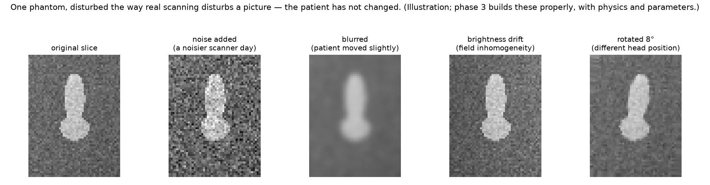
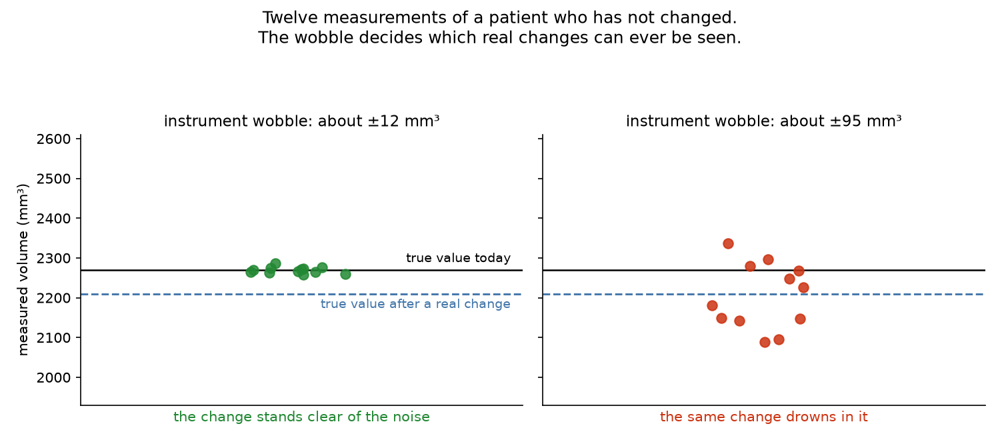
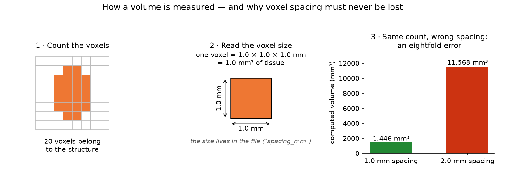

# 00 · Glossary

[← Build guide](../BUILD_GUIDE.md) · [README](../README.md) · [Architecture](02-architecture.md)

Every term used anywhere in this project, in plain language, with an everyday
comparison where one helps. Keep this open while you read anything else. If a
word appears in the repository and is not here, that is a documentation bug
worth reporting.

Two groups: **the subject** (scans, structures, statistics) and **the
machinery** (software, tools, workflow). Within each, alphabetical.

---

## Part 1 — The subject: images, measurement, statistics

**Affine.** The 4 × 4 table of numbers in a scan's header that says how big
each voxel is and which way is up. *Everyday version:* the scale bar on a map.
Without it, the map's shapes mean nothing in kilometres. Lose the affine and
every volume you compute is wrong by an unknown factor.

**Bias field.** A slow, smooth brightness drift across an MRI: one side of the
image brighter than the other, for physical reasons rather than anatomical
ones. *Everyday version:* a photo taken with a lamp off to one side.

**Biomarker.** Any measurement that stands in for something about a patient.
An **imaging biomarker** is one computed from a scan, such as the volume of a
structure in cubic millimetres. *Everyday version:* the number on a bathroom
scale standing in for "how the diet is going".

**Bland–Altman plot.** A chart for comparing two measurements of the same
thing: their average on the horizontal axis, their difference on the vertical.
It reveals whether the error grows with the size of what you measure, which a
single correlation number hides. *Everyday version:* checking whether your
kitchen scale is fine for flour but hopeless for a whole turkey.

**Contrast.** How different in brightness a structure is from what surrounds
it. Low contrast means the edge is hard to find, for a human or a computer.

**CT (computed tomography).** An imaging method using X-rays from many angles.
Values are in standard units (Hounsfield units), which makes CT easier to
compare across scanners than MRI. StableSeg's perturbation profile for CT is
on the roadmap.

**Dice score.** A number from 0 to 1 saying how much two outlines overlap: 1 is
perfect agreement, 0 is none. The standard way segmentation accuracy is
reported. *What it does not tell you:* whether the measurement is stable, which
is the gap this project exists to fill.

**DICOM.** The file format hospitals use: typically one file per image slice,
carrying extensive patient and scanner information in its header. *Everyday
version:* a stack of individually labelled photographs.

**Ground truth.** The correct answer, usually an outline drawn by an expert.
Real scans have an expert's opinion; synthetic phantoms have an actual known
truth, which is why this project generates them.

**Hausdorff distance.** The worst-case gap between two outlines: how far the
most badly misplaced piece of a boundary is from where it should be.
*Everyday version:* not "how similar are these two coastlines on average", but
"where is the single biggest error, and how big is it".

**Hippocampus.** A small, curved structure deep in each half of the brain,
central to memory. It shrinks in neurodegenerative disease, so its volume
measured from MRI is used as an endpoint in clinical trials. StableSeg's first
real target.

**ICC (intraclass correlation coefficient).** A number from 0 to 1 saying what
fraction of the total variation in your measurements is real difference
between subjects, rather than measurement noise. High ICC means the
measurement separates people well. *Everyday version:* if everyone's weight
readings jump by two kilos at random, but people differ from each other by
thirty, the scale still ranks people correctly — ICC is high. If people differ
by one kilo, it does not — ICC is low.

**Label / mask.** The result of segmentation: a volume the same size as the
scan, where each voxel says which structure it belongs to (0 = background,
1 = first structure, 2 = second). *Everyday version:* a colouring-in layer
traced over a photograph.

**Minimum detectable change.** The smallest real change in a measurement that
can be told apart from measurement noise. The single most useful output of
this project. *Everyday version:* if your scale wobbles by two kilos, do not
believe a one-kilo loss.

**Modality.** The kind of imaging: MRI, CT, PET, ultrasound, and so on. Each
has its own physics and therefore its own realistic disturbances, which is why
StableSeg organises perturbations into **modality profiles**.

**Morphology (in image processing).** Simple operations that grow, shrink,
clean up or fill in a mask by looking at each voxel's neighbours. *Everyday
version:* tidying a hand-traced outline by rubbing out stray specks and
filling small gaps.

**MRI (magnetic resonance imaging).** An imaging method using strong magnets
and radio waves. Excellent soft-tissue contrast; its brightness values are not
in standardised units, which makes comparisons across scanners genuinely hard.

**NIfTI (`.nii`, `.nii.gz`).** The research file format for 3-D scans: one
file holds the whole volume plus a header with the voxel size and orientation.
*Everyday version:* one labelled box holding the entire stack of slices,
versus DICOM's loose pile of photographs.

**Normalisation (intensity).** Rescaling brightness values into a common range
so scans can be compared. *Everyday version:* adjusting the exposure on
photographs taken in different light before comparing them.

**Phantom.** A stand-in object used to test a measuring instrument, in place of
a real patient. In hospitals a physical phantom is a plastic or gel object of
known size that is scanned to check a scanner is measuring correctly. A
**digital phantom** is the same idea in software: an image generated by code,
containing shapes whose true size is known exactly, used to test an analysis
pipeline. *Everyday version:* the 1 kg calibration weight you put on a scale to
check the scale, rather than weighing a person and hoping. StableSeg generates
its own digital phantoms (`stableseg phantom`) for three reasons: the tests run
anywhere in seconds with no download; the true volume is known, so the pipeline
can be checked against an answer key that real scans never have; and the same
seed reproduces them identically on any machine. **They are synthetic, they are
not scans of anyone, and every document says so.** Built by
`src/stableseg/phantom.py`; explained step by step in
[phase 1, section 5](04-phase-tutorials/phase-01-skeleton.md).

**Perturbation.** A deliberate, controlled change to a scan that imitates a
real cause of scan-to-scan difference: noise, blur, a movement artefact, a
different slice thickness. The scan changes; the patient did not. The heart of
this project.

  

**Preprocessing.** Everything done to a scan before analysis: fixing
orientation, resampling to a common voxel size, normalising brightness,
sometimes denoising. *Everyday version:* squaring up and cropping a scanned
document before reading it.

**QIBA (Quantitative Imaging Biomarkers Alliance).** The group that publishes
the standard vocabulary for imaging-measurement quality — repeatability
coefficient, within-subject coefficient of variation, and so on. This project
uses their terms rather than inventing its own.

**Registration.** Aligning two scans of the same anatomy so they sit in the
same position. **Rigid** registration allows only rotation and shifting;
**deformable** allows stretching. *Everyday version:* laying two tracing-paper
copies of the same map on top of each other until they line up.

**Repeatability.** How close repeated measurements of the same unchanged thing
are to each other, with everything kept as constant as possible. Contrast with
**reproducibility**, which is the same question when something deliberately
differs (a different scanner, a different operator).

  

**Repeatability coefficient (RC).** A single number, in the units of your
measurement, such that the difference between two repeat measurements will be
smaller than it about 95 % of the time. *Everyday version:* "two weigh-ins of
the same person will agree within 1.4 kg."

**Resampling.** Recomputing a scan onto a different grid of voxels, for
example from 1.5 mm slices to 1 mm. Always involves interpolation, so always
loses or invents a little detail.

**Segmentation.** Drawing the outline of a structure on every slice of a scan,
usually by computer. The output is a mask. *Everyday version:* tracing one
country on every page of an atlas so you can measure its area.

**Sphericity.** A shape number saying how close a 3-D object is to a perfect
ball. Useful because a mask can have the right volume and still be the wrong
shape.

**Surface distance (normalised).** How far apart two outlines are along their
boundaries, on average. Complements Dice: two masks can overlap well and still
have a boundary error that matters clinically.

**Test–retest.** Scanning the same person twice with nothing changed in
between, to see how much the measurement moves. Rare in public data, which is
why StableSeg *simulates* it with perturbations — and says so in every report.

**Synthetic data.** Data created by a program rather than measured from the
world. Used here because no public dataset offers what the tests need, and
because a generated case can have a known true answer. Companies use it for
privacy, for rare events, and where no real data exists. Legitimate when
disclosed; dishonest when passed off as real. StableSeg labels it `synthetic:
true` inside the files themselves and states it in every document.

**Voxel.** A three-dimensional pixel: one small box in a scan. Multiply its
three side lengths to get its volume in cubic millimetres. Count the voxels in
a mask, multiply by that, and you have the biomarker.

  

**wCV (within-subject coefficient of variation).** The measurement noise
expressed as a percentage of the measurement itself. *Everyday version:*
"repeat weigh-ins of the same person vary by about 1.5 % of their weight."
Convenient because a percentage is comparable across structures of different
sizes.

**U-Net.** A particular design of neural network, shaped like the letter U,
that has been the standard architecture for medical image segmentation since
2015. A **3D U-Net** works on whole volumes rather than single slices.

---

## Part 2 — The machinery: software, tools, workflow

**API.** The set of functions one piece of software offers to another. *Everyday version:* the serving hatch between a
kitchen and a dining room — a defined opening through which things pass, so
neither side needs to know how the other is arranged. In this project,
`src/stableseg/api.py`.

**Argument / option (command line).** Extra information given to a command. An
argument is required and positional (`stableseg describe FILE`); an option is
named and usually optional (`--config configs/phantom.yaml`).

**Artefact (software).** A saved output file: a table, a chart, a trained
model. Computed slowly once, reused instantly many times. (Not to be confused
with an imaging **artefact**, which is a distortion in a scan. Both words
appear in this project; context separates them.)

**Backend.** The code doing the real work behind the scenes. *Everyday
version:* a restaurant kitchen. Customers never see it, only its results.

**Branch (Git).** A parallel line of snapshots. This project uses three:
`master` (released), `beta` (pre-release mirror), `develop` (all work).

**CI (continuous integration).** A service that automatically installs and
tests your project on fresh machines every time you push. *Everyday version:*
a colleague who silently rebuilds your work from scratch on three different
computers after every change and tells you if it broke. Ours is GitHub
Actions.

**CLI (command-line interface).** A program driven by typed commands rather
than clicks. `stableseg phantom` is one.

**Commit.** A saved snapshot of the whole project in Git, with a message
saying what changed. *Everyday version:* pressing save in a game, with a note.

**Config (configuration file).** A file holding the settings for a run, rather
than typing them each time. Ours are YAML files in `configs/`. *Everyday
version:* a recipe card, so the same dish can be made again identically.

**Dependency.** A library your project needs in order to run. Listed in
`pyproject.toml`; pinned to exact versions in `requirements.lock`.

**DuckDB.** A database that lives in a single file on your disk with no server
to run. Used from phase 4 to hold every measurement. *Everyday version:* a
filing cabinet you can question precisely, rather than a pile of loose
spreadsheets.

**Database.** Organised storage arranged in tables, questioned with a language
called SQL. *Everyday version:* a well-labelled pantry versus bags on the
floor.

**Editable install (`pip install -e`).** Installing your own project so that
Python can find it from anywhere, while still pointing at your working folder,
so edits take effect immediately without reinstalling.

**Environment variable.** A setting that lives in your shell rather than in a
file, often used for secrets. `.env.example` shows which ones this project
might use; `.env` (never committed) would hold real values.

**Fixture (testing).** A ready-made object or folder that tests share, so each
test starts from a known state. Ours are in `tests/conftest.py`.

**Frontend.** The part a person looks at and clicks. *Everyday version:* the
restaurant dining room. Ours will be a Streamlit page.

**Git.** A save-game system for a folder of code: snapshots, branches, and the
ability to return to any earlier state.

**GitHub.** A website that stores Git snapshots online, so they survive your
laptop and other people can read them.

**JSON.** A plain-text way of writing structured data: names and values in
braces. Every StableSeg command prints JSON so that both humans and other
programs can read the output.

**Lock file.** A list of every dependency at one exact version, produced from a
working install (`requirements.lock`). *Everyday version:* not "buy flour" but
"buy this brand, this bag, this batch", so the recipe comes out the same.

**Linter.** A tool that reads your code and points out mistakes and
inconsistencies without running it. Ours is `ruff`. *Everyday version:* a
spell-checker for code.

**`.nii.gz`.** A NIfTI file that has been compressed. `.nii` is the scan, `.gz`
means it was squeezed smaller with a program called gzip (the same compression
as a `.zip`, different container). Analysis tools read `.nii.gz` directly
without you unzipping anything. *Everyday version:* a vacuum-packed bag — same
contents, less shelf space, opened automatically by whatever needs it.

**`phantom_000.nii.gz` (reading a StableSeg filename).** `phantom` says it came
from the generator rather than a real scanner; `000` is the case number,
zero-padded so that case 2 sorts before case 10 rather than after it;
`.nii.gz` is the compressed 3-D image format. The file at
`data/phantom/images/phantom_000.nii.gz` is the *picture* of case 0, and
`data/phantom/labels/phantom_000.nii.gz` is the matching *outline* — same case,
same size, same grid, one file saying how bright each voxel is and the other
saying which structure it belongs to. Pairing them by identical filename in two
folders is a convention this project borrows from public imaging datasets.

**Checksum (MD5).** A fixed-length fingerprint computed from every byte of a
file; change one byte and it changes completely. Used to prove a download is
the file the authors published, intact. *Everyday version:* the seal on a
parcel — you do not open one whose seal is broken. Not a defence against a
determined attacker, but a reliable one against the failures that actually
happen: truncated downloads, flipped bits, silently replaced files.

**Idempotent.** Doing it again changes nothing. A fetch that is idempotent
downloads nothing the second time; a setup script that is idempotent can be
re-run without fear. *Everyday version:* pressing the lift button twice.

**Archive (tar).** Many files bundled into one, the way datasets are
distributed. Unpacking recreates the folder structure. Two hazards handled
here: hidden `._` companion files that Mac-made archives carry (dropped), and
entries whose path would write outside the chosen folder (refused).

**AppleDouble (`._` files).** Hidden companions macOS writes beside every file
in some archives to store extra attributes. They are named like the real
files and are not them; a loader that counts them gets the wrong answer.

**Registry (of datasets).** One entry per dataset — where it is, what its
checksum must be, how it is licensed, where its data card lives — so a
dataset is fetched from a description, never from a bare URL in a script.

**DICOM tag.** One labelled field in a DICOM file's header — patient name,
pixel spacing, position in space — identified by a pair of numbers such as
`(0028,0030)`. A slice carries hundreds.

**Series (DICOM).** One scan's worth of slices, sharing an identifier. A
hospital export puts one series per folder; the reader here refuses a folder
holding two rather than guessing which slices belong together.

**LPS and RAS.** Two conventions for which way the axes point. DICOM uses
**LPS** — x toward the patient's Left, y Posterior, z Superior. NIfTI uses
**RAS** — Right, Anterior, Superior. They differ by flipping the first two
axes; ignore that and a brain's left becomes its right. The project converts
everything to RAS so all scans share one frame.

**Manifest.** A plain table listing every case in a dataset with its key facts.
Ours is `data/phantom/manifest.csv`, one row per phantom with its known true
volumes. *Everyday version:* the packing list in a shipping crate.

**Package (Python).** A folder of code that Python can import by name once
installed. Ours is `stableseg`, living under `src/`.

**pathlib.** Python's modern way of handling file paths, which works
identically on Windows, macOS and Linux. Using it everywhere is why this
project runs unchanged on all three.

**pip.** The tool that installs Python libraries.

**Provenance.** The record of what produced a result: which version of the
code, which settings, when. Every StableSeg run writes `run.json`. *Everyday
version:* the label on a lab sample saying who took it, when, and how.

**Prompt (terminal).** The text the terminal shows before you type, indicating
where you are. When it starts with `(.venv)`, the project's private toolbox is
active.

**pydantic.** A library that checks structured settings against declared types
and rules, refusing bad input with a clear message. *Everyday version:* a form
with typed boxes that will not submit if you write "eight" where a number
belongs.

**pytest.** The tool that runs the automated tests.

**Quarto.** A tool that combines text, code and the code's output into one
polished document that regenerates itself when the data change. *Everyday
version:* a lab notebook that re-runs its own calculations.

**Reproducibility.** The property that running the same code on the same
inputs gives the same outputs, on any machine, at any time. Achieved here with
fixed random seeds, pinned dependencies and one-way data flow.

**Repository (repo).** The project folder, together with its Git history.

**Seed (random).** A starting number for a random-number generator. The same
seed produces the same sequence, which is what makes "random" data
reproducible. This project passes seeds explicitly everywhere and never relies
on a global one.

**Shell.** The program interpreting your typed commands. PowerShell on
Windows, `zsh` or `bash` on macOS, `bash` on Linux.

**SQL.** The language for asking a database questions. *Everyday version:* a
very literal, very patient librarian.

**src layout.** Putting the code one folder down, in `src/`, so Python cannot
import it accidentally from the project root and tests are forced to use the
properly installed version. Prevents a whole class of "works on my machine"
failures.

**Storage abstraction.** A small interface all output goes through, so that
changing where results live (local folder now, cloud bucket later) means
writing one new class instead of editing the whole project.

**Streamlit.** A tool that turns a Python script into an interactive web page
without writing any web code.

**Terminal.** The window where you type commands. Not the same thing as the
shell running inside it, but in practice people use the words
interchangeably.

**Test (unit test).** A small automated check proving one piece of code does
what it claims. *Everyday version:* weighing a known 1 kg reference before
trusting the scale.

**Version (semantic).** Three numbers, `MAJOR.MINOR.PATCH`. A new PATCH fixes
things, a new MINOR adds capability, a new MAJOR breaks compatibility.
StableSeg is at 0.1.0: early, capability being added, interfaces may still
change.

**Virtual environment (`venv`).** A private toolbox for one project: its own
copies of libraries, isolated from the system and from other projects.
*Everyday version:* a separate toolbox per job, so the plumbing tools do not
end up mixed into the electrical kit.

**YAML.** A plain-text format for settings, using indentation instead of
brackets. Our config files are YAML.

---

*Missing a word? Open an issue titled "glossary: <word>". A term used but not
defined is a defect in the documentation, not a gap in the reader.*

---

## Part 3 — Digital pathology and spatial biology

*Track P's vocabulary. Every term used anywhere in the pathology track is
defined here, with an everyday comparison. Read in any order.*

**Histology.** The study of tissue under a microscope. A sliver of tissue a few
thousandths of a millimetre thick is placed on a glass slide, stained so its
parts become visible, and examined. *Everyday version:* looking at the weave
of a fabric through a magnifying glass rather than judging the coat from
across the room.

**Slide.** The glass rectangle carrying one thin tissue section. Everything in
Track P starts as a slide.

**Whole-slide image (WSI).** A slide, scanned at very high resolution into one
enormous digital picture — routinely 100,000 pixels on a side and several
gigabytes. *Everyday version:* a satellite map of a whole city, where you can
zoom from the city outline down to a single doorstep. Nobody looks at all of it
at once, which is why the next two terms exist.

**Pyramid (image pyramid).** A whole-slide image stored at several resolutions
at once — the full picture, a half-size copy, a quarter-size copy, and so on —
so a viewer can show the whole slide at low resolution and zoom into any part at
full resolution without loading everything. *Everyday version:* a map app that
keeps street level, district level and country level as separate layers.

**Tile.** A small square cut from a whole-slide image at one pyramid level,
typically 224 to 1024 pixels on a side. Analysis happens on tiles because a
whole slide does not fit in memory. This project's core audit runs on tiles,
which is what keeps it CPU-first.

**Microns per pixel (MPP).** The physical size of one pixel in a pathology
image, in micrometres (thousandths of a millimetre). It is the pathology
equivalent of *voxel spacing*: the number that turns a pixel count into an area,
and the number that must never be separated from the picture. A nucleus that
is 40 pixels across is 10 µm at 0.25 MPP and 20 µm at 0.5 MPP.

**Magnification.** The objective-lens power a slide was scanned at — 20× or
40× are the common ones. It maps loosely to microns per pixel (40× is roughly
0.25 MPP; 20× roughly 0.5 MPP), but the MPP is the exact number and the one the
project stores.

**H&E (hematoxylin and eosin).** The standard tissue stain, used for over a
century. **Hematoxylin** colours cell nuclei blue-purple; **eosin** colours the
cytoplasm and surrounding material pink. Nearly every pathology slide a
pathologist first looks at is H&E. *Everyday version:* highlighting a document
with two colours — one for headings (nuclei), one for body text (everything
else).

**Stain.** A dye that binds to particular tissue components so they show up
under the microscope. Tissue is nearly transparent unstained.

**Optical density (OD).** How much light a stained pixel absorbs, rather than
how bright it looks. Stains *absorb* light, and absorbances add up where two
stains overlap, while brightnesses do not — so the maths of separating stains
is done in optical density. *Everyday version:* stacking two coloured filters
in front of a lamp: each filter removes a fraction of the light, and the
fractions multiply, which becomes simple addition once you take a logarithm.

**Colour deconvolution.** Separating a stained picture into one channel per
stain — "how much hematoxylin is here" and "how much eosin is here" — by
undoing the mixing in optical-density space. The classical way to find nuclei
in H&E without any learning. *Everyday version:* un-mixing a purple paint back
into its blue and red.

**Stain vector.** The colour, in optical density, that a pure stain produces.
Colour deconvolution needs one per stain; they differ between laboratories,
scanners and batches, which is precisely the variation Track P audits.

**Stain normalisation.** Adjusting a picture so its stains match a reference
appearance, to reduce the differences between laboratories and scanners.
Macenko and Vahadane are the two classical methods; learned models exist too.
Whether normalisation actually reduces *biomarker* variability, and by how
much, is one of the questions this project asks rather than assumes.

**Scanner variability.** Different slide scanners record the same slide with
different colours, sharpness and contrast. Together with staining variation it
is the largest source of avoidable wobble in pathology AI, and a model that has
only seen one scanner often fails on another.

**Batch effect.** Systematic differences between groups of samples caused by
*how* they were processed — which day, which laboratory, which scanner — rather
than by biology. The pathology version of a scale that reads differently in
the morning. Stain and scanner variability are batch effects.

**IHC (immunohistochemistry).** A stain that marks one specific protein using
an antibody, so cells expressing that protein change colour. Used to decide
treatments — HER2 in breast cancer, PD-L1 in several cancers, Ki-67 for how
fast cells divide. *Everyday version:* a highlighter that only marks one
particular word wherever it appears.

**Chromogen.** The coloured product that makes an IHC-positive cell visible;
DAB (brown) is the common one, against a blue hematoxylin counterstain.

**Positive fraction (percent positive).** The share of cells whose IHC signal
is above threshold. A biomarker, and one whose wobble under stain and scanner
change is exactly the kind of thing this project measures.

**H-score.** An IHC summary from 0 to 300 combining *how many* cells are
positive with *how strongly*: 1 × (% weak) + 2 × (% moderate) + 3 × (% strong).
Used clinically; audited here for stability.

**mIF (multiplex immunofluorescence).** Several antibodies at once, each
attached to a differently coloured fluorescent dye, so one section shows
multiple proteins as separate channels. Where H&E gives one picture, mIF gives
a stack — six, eight, forty channels. Stored as multichannel OME-TIFF.

**Channel.** One "colour" of a multichannel image, usually one marker in mIF.
The channel *names* (which protein each is) are part of the geometry the
project never separates from the numbers.

**OME-TIFF.** A standard image format for microscopy that carries the channel
names, physical pixel size and other metadata inside the file. The pathology
equivalent of NIfTI carrying voxel spacing.

**Gating.** Deciding, per cell, whether each marker is "on" or "off" by
thresholding its intensity — then combining the on/off pattern into a cell
type. *Everyday version:* sorting post by a checklist: has stamp, has address,
has return label → deliverable.

**Phenotype (cell phenotype).** A cell type defined by which markers it
expresses — for example CD3⁺CD8⁺ for a cytotoxic T cell. Phenotype *counts and
densities* are among the most used pathology biomarkers, and among the most
sensitive to stain and scanner variation.

**Nucleus detection / nucleus segmentation.** Finding every cell nucleus in a
tile (detection: where are they) or outlining each one (segmentation: exactly
which pixels). Nuclei are the anchors for counting cells, measuring their shape
and building cell graphs. The classical route is colour deconvolution plus
blob finding; the learned route is a pretrained model such as Cellpose.

**Nuclear morphometrics.** Measurements of nucleus shape and size: area,
eccentricity, solidity. Long used by pathologists by eye; computed here per
nucleus and audited per tile.

**Tissue segmentation.** Outlining tissue *regions* — tumour, stroma, necrosis,
background — rather than individual cells. The pathology counterpart of
outlining a hippocampus.

**Tumour area fraction.** The share of the tissue area that the segmenter
labels tumour. A region-level biomarker.

**Tumour microenvironment (TME).** Everything around the tumour cells: immune
cells, blood vessels, supporting tissue. Much of modern oncology asks what the
microenvironment looks like, which is what spatial statistics measure.

**TIL (tumour-infiltrating lymphocytes).** Immune cells found inside or
around a tumour; their density is a biomarker linked to treatment response. An
*immune-infiltration proxy* is any measured stand-in for it, such as
lymphocyte density near tumour.

**Spatial statistics.** Numbers describing *where* cells are relative to each
other, not just how many. Nearest-neighbour distance, Ripley's K and the
neighbourhood enrichment test are the ones used here.

**Nearest-neighbour distance.** For each cell, how far to the closest cell of
some type. Averaged, it says whether two cell types sit together or apart.

**Ripley's K (and L).** A function of distance that says whether points are
clustered, random or evenly spread at that distance. *Everyday version:* count
how many neighbours each house has within 100 m, then 200 m, then 500 m, and
compare with what a random scatter of houses would give. L is K rescaled so
that "random" is a straight line, which is easier to read.

**Neighbourhood enrichment.** A test of whether cells of type A are found next
to cells of type B more (or less) often than chance. The standard way to ask
"do immune cells crowd around tumour cells here?"

**Interaction counts.** Simply counting the pairs of neighbouring cells by
type — A next to B, B next to C — the raw material for neighbourhood
enrichment.

**Cell graph.** The cells of a tile turned into a network: each nucleus a node,
each pair of nearby nuclei an edge. *Everyday version:* a map of a village
where every house is a dot and every pair of neighbours is a line. Graphs let
a model reason about *arrangement*, not just counts.

**Geometric deep learning / graph neural network (GNN).** Neural networks that
work on graphs rather than grids of pixels. A GNN over a cell graph can
produce a single number for the whole tile — a graph-level biomarker — that
depends on how cells are arranged. Audited here for stability like any other
biomarker.

**Embedding.** A list of numbers a model produces to summarise a picture — a
few hundred to a few thousand numbers per tile — arranged so that similar
tiles get similar lists. *Everyday version:* describing a person by ten scores
(height, age, …) instead of a photograph, so you can compare people by
arithmetic.

**Representation learning.** Teaching a model to produce good embeddings, so
that downstream tasks (classification, prediction) can be done with simple
models on top of them.

**Self-supervised learning.** Training a model on unlabelled pictures by making
it solve puzzles about them — predict the hidden part, recognise the same tile
after distortion — so no pathologist has to label anything. This is how
pathology foundation models are trained.

**Foundation model.** A large model trained once, self-supervised, on an
enormous collection of images, then reused for many tasks by extracting
embeddings or fine-tuning. Several exist for pathology; this project does not
train one, it *audits* them: do their embeddings, and the biomarkers built on
them, stay put when the stain or scanner changes?

**Embedding drift.** How far a tile's embedding moves under a disturbance. The
foundation-model version of "how much did the volume wobble".

**Benchmark harness.** A program that runs the same test on several models or
methods with the same settings and produces one comparison table. Here it
ranks segmenters and feature extractors by *stability* rather than only by
accuracy.

**Multimodal.** Using two kinds of data about the same sample together — an
H&E picture and its IHC counterpart, or a tile and the gene expression measured
underneath it. A multimodal *model* predicts one from the other or combines
both.

**Virtual staining / stain translation.** A generative model that turns one
stain into another — H&E into a predicted IHC, for instance — without doing
the real stain. Compared here with classical normalisation on one measurable
criterion: does it reduce biomarker variability?

**Generative model.** A model that produces new pictures (or new versions of a
picture) rather than a label. Stain translation and synthetic-tile generation
are the uses here.

**Spatial transcriptomics.** Measuring which genes are active at many
positions across a tissue section, so gene expression can be laid over the
picture. *Everyday version:* a map of a city where every neighbourhood is
annotated with what its residents do for a living.

**Spot.** One measurement position in spatial transcriptomics — in the common
Visium platform, a circle about 55 µm across containing a few cells, with a
list of gene counts attached.

**AnnData.** The standard data container for spatial transcriptomics and
single-cell analysis in Python: a table of measurements plus annotations,
handled by the scanpy and squidpy libraries.

**Tissue microarray (TMA).** Many small tissue cores from many patients
arranged on one slide, so they can be stained and scanned together. PLISM is
built from them.

**Synthetic H&E phantom.** Track P's equivalent of the MRI phantom: a
generated tile with nuclei drawn as ellipses and coloured through the H&E
optical-density model, so the number of nuclei, their positions and — for the
IHC and mIF variants — the positive fraction and phenotype proportions are
known exactly. Synthetic, labelled as such, and the reason every Track P test
runs with no download.

**OpenSlide.** The open-source library that reads the many proprietary
whole-slide formats (each scanner manufacturer has its own). Installed here as
a self-contained pip package on all three operating systems.

**QuPath.** A widely used open-source desktop program for viewing and
annotating whole-slide images. The project plans to export its overlays in a
form QuPath can open.

**DICOM-WSI.** The hospital DICOM standard extended to whole-slide images, so
pathology can live in the same archives as radiology. On the roadmap.

**OME-Zarr.** A cloud-friendly, chunked format for very large images, the
successor direction to OME-TIFF for storage at scale. On the roadmap.
