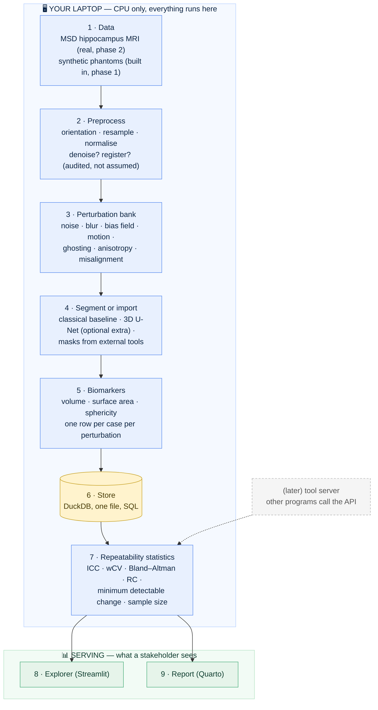
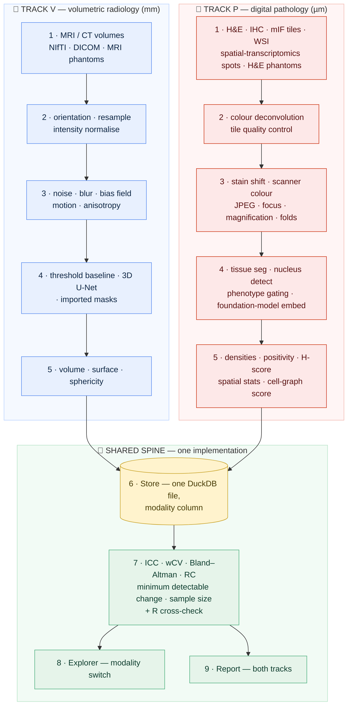

# 02 · Architecture, Explained From Scratch

[← README](../README.md) · [All docs in order](../README.md#the-tutorial-in-order) · [Glossary](00-glossary.md)

**Prerequisites:** none. This is the first thing to read after the README.
**Learning goal:** after this page you can say what every part of StableSeg does, why it exists, and how a scan travels from a file on disk to a sentence in a report, even if you have never built software before.
**Checkpoint:** you can explain, in your own words, the difference between a *backend*, a *frontend* and a *database*, name the nine boxes in the diagram, and say why the audit engine must not depend on any one segmentation model.

---

## 1. What is StableSeg, in one honest sentence?

StableSeg takes a piece of software that measures something in a medical image — the volume of a brain structure in an MRI, or the density of a cell type on a stained tissue slide — deliberately disturbs the image in realistic ways, measures again and again, and reports how much the measurement wobbles when the patient has not changed, so that anyone relying on that measurement knows its noise floor before they trust it.

It does this on **two tracks** that share one statistical spine: **Track V** (volumetric radiology: MRI and CT, in millimetres) and **Track P** (digital pathology: H&E, IHC and multiplex-immunofluorescence tiles, in microns). The question, the statistics and the report are the same; only the picture and the disturbances differ. Section 4b draws both.

If you know nothing about medicine or software, here is the everyday version:

> You have a bathroom scale and you want to know if it is good enough to track a diet. You step on it fifty times in slightly different ways (left foot first, right foot first, slightly to the side, after moving it to the bathroom mat) and write down every reading. The spread of those readings is the scale's own wobble. If the wobble is two kilograms, the scale cannot tell you about a one-kilogram loss, however precise the display looks. StableSeg does this for a scan-measuring program instead of a scale.

---

## 2. The three words you must know first

Almost every confusing software conversation becomes clear once you know these three. The running analogy is a restaurant.

### Backend: the kitchen
Everything that happens behind the scenes: preparing ingredients, cooking, plating. Customers never enter the kitchen. In software, the backend is the code that does the real work. In StableSeg, the backend loads scans, perturbs them, segments them, measures them and computes statistics. Nobody "sees" it; they see its results.

### Frontend: the dining room
The part a person sits in and interacts with: the menu, the table, the plated dish. In software, the frontend is the screen someone looks at and clicks. StableSeg's frontend (a later phase) is a Streamlit web page where someone picks a perturbation and watches the biomarker move.

### Database: the pantry
An organised store you fetch from precisely, instead of rummaging through bags on the floor. You ask it questions in a language called SQL ("give me every case whose volume changed by more than five percent under motion"). StableSeg's database (phase 4) is a single DuckDB file.

> **Why a database, if we have files?** Because once every measurement lives in one place, the explorer, the report and the statistics all read from one trusted source instead of five slightly different copies. One pantry, not five half-empty cupboards.

---

## 3. A few more terms, defined once

- **Scan / volume.** A 3-D image: a stack of 2-D slices. Stored as a block of numbers plus a header saying how big each voxel is and which way is up.
- **Voxel.** A 3-D pixel. Multiply its three sides to get its volume in cubic millimetres.
- **Segmentation.** Drawing the outline of a structure on every slice. The result is a **mask**: a volume of the same size where each voxel says "inside (1)" or "outside (0)". Real hippocampus data uses 1 for the head and 2 for the body.
- **Biomarker.** A number computed from the mask that stands in for something about the patient. The first one here is volume in mm³.
- **Perturbation.** A deliberate, controlled change to a scan that imitates something real: patient movement, a noisier scanner, a different slice thickness. The scan changes; the patient did not.
- **Repeatability.** How close repeated measurements of the same thing are to each other. The statistics in phase 5 (ICC, wCV, Bland–Altman, repeatability coefficient, minimum detectable change) are different ways of putting a number on it. Each is explained from zero in that phase and in the glossary.
- **Pipeline.** A fixed sequence of steps, like an assembly line. StableSeg's is: load → preprocess → perturb → segment → measure → store → analyse → serve.
- **Artefact.** A saved output file: a table, a chart, a mask. Computed once, reused many times.
- **Provenance.** The record of what produced a result: which code version, which config, when. If a number is questioned, provenance is how you walk it back.

---

## 4. The nine boxes, and why each one exists



*(Reading this as plain text? Top to bottom: data feeds preprocessing, which feeds the perturbation bank, which feeds segmentation, which feeds measurement, which fills the store; the statistics read the store and feed both the explorer and the report.)*

### Box 1 — Data · *backend*
**What:** the scans and, where available, the expert masks that go with them. On Track P: tiles cut from whole-slide images, multichannel mIF stacks, spatial-transcriptomics spot tables, and the synthetic H&E phantoms — every real dataset described in its [data card](data-cards/README.md).
**Why two sources:** the synthetic phantoms (phase 1) have a *known* true volume and generate in seconds on any machine, so the tests and the first end-to-end run need no download and the pipeline can be checked against an answer key. The real MRI (phase 2) is where the audit becomes meaningful.
**Where:** `src/stableseg/phantom.py` today; a NIfTI-folder loader and a DICOM reader in phase 2.

### Box 2 — Preprocess · *backend*
**What:** put every scan into the same orientation, resample to the same voxel size, scale intensities to a common range.
**Why it exists:** a segmenter must see comparable inputs. Two further steps, denoising and rigid registration (re-aligning a moved scan), are treated as *experiments*: the audit runs with and without them and measures whether they reduce the wobble. Most pipelines assume they help; this one checks.

### Box 3 — Perturbation bank · *backend*, the heart of the project
**What:** a set of named, parameterised disturbances, each imitating one real-world cause of scan-to-scan difference. Organised by **modality profile**: the MRI profile today (noise, blur, intensity scaling, bias field, motion, ghosting, anisotropic resampling, small rotation/translation); a CT profile on the roadmap.
**Why it exists:** real repeat scans of the same person are rare in open data. Simulating the causes of difference, one at a time and in combination, is how we ask "which of these hurts the measurement, and how much?"
**Design rule:** the core bank is NumPy/SciPy only, so it runs everywhere. TorchIO (optional extra, phase 6) adds physics-grade k-space motion and ghosting.

### Box 4 — Segment or import · *backend*
**What:** turn a scan into a mask.
**Why three ways:** a classical baseline (threshold + morphology) proves the audit works before any deep learning exists and gives the U-Net something to beat; the MONAI 3D U-Net (optional extra) is the modern segmenter; the import path lets masks produced by *any other tool* be audited without retraining. That last one is what makes StableSeg a tool rather than a demo.
**The rule that makes the whole design work:** the audit engine sees a segmenter as one function, `segment(volume) -> mask`. It does not care what is inside.

### Box 5 — Biomarkers · *backend*
**What:** numbers from masks. Volume first; surface area, sphericity and bounding-box extents follow.
**Why several:** volume is what trials use; shape features move differently under perturbation and tell you *how* a mask went wrong, not just that it did.

### Box 6 — Store · *database*
**What:** one DuckDB file holding a row per case per perturbation per biomarker, plus the run ledger.
**Why:** joins and aggregations in SQL are how the statistics, the explorer and the report all read the same truth. It is also the seam where a clinical-covariates table would be joined later.

### Box 7 — Repeatability statistics · *backend*
**What:** the audit's verdict, in the vocabulary a trialist uses.
**Why each number:** ICC says how much of the total variation is real between-subject difference rather than measurement noise; wCV puts the noise as a percentage of the measurement; Bland–Altman shows whether the error depends on the size of the structure; the repeatability coefficient and the **minimum detectable change** answer "how big must a change be before I believe it?"; the sample-size calculator answers "how many subjects do I need to see a change of *x* percent?" Every formula is written out and unit-tested; an R cross-check confirms the ICC to four decimals.

### Box 8 — Explorer · *frontend*
**What:** a Streamlit page: choose a perturbation, watch the biomarker distribution move; list the cases whose measurement is unreliable; use the sample-size calculator.
**Why:** a stakeholder should not need Python to ask "what if the scanner is noisier?"

### Box 9 — Report · *the record*
**What:** a Quarto document that re-renders itself from the store: methods, figures, tables, the minimum detectable change, the stated limitations.
**Why:** an audit is only useful if there is a document someone can read and file. A dashboard alone is not a record.

### The same nine boxes, on two tracks

Every box above exists on both tracks. Boxes 1–5 have a track-specific
implementation (a 3-D volume is not a 2-D tile, and stain drift is not
magnetic-field drift); boxes 6–9 are **shared and built once**.



*(Plain text: two parallel pipelines — radiology on the left, pathology on the
right — each running data → preprocess → perturb → segment → measure, and both
writing into one shared store that feeds one statistics module, one explorer
and one report.)*

**What "shared" buys.** The statistics are written once and cross-checked in R
once. A pathologist and a radiologist reading the report see the same table
layout, the same minimum-detectable-change column, the same sample-size
calculator. And the geometry rule is the same rule in both worlds: a 3-D
volume carries its voxel spacing, a tile carries its microns-per-pixel and
channel names, and no function in the project is allowed to separate the
numbers from either.

**What differs, honestly.** Track P has something Track V lacks: a real
test–retest dataset (the same tissue under seven scanners and thirteen
stains — see the [PLISM data card](data-cards/plism.md)), so its simulated
disturbances can be validated against real ones. Track V's repeats are
simulated until a public same-subject repeat-MRI set is adopted.

### The dotted box — a tool server (roadmap)
Because every capability is a plain function in `api.py`, a small server can expose those functions to other programs. Nothing about it is built today; the API surface is shaped so that adding it later is additive, not a rewrite. Judged in `06-product-and-technology-roadmap.md`.

---

## 5. How the code is layered, and why that is not optional

```
stableseg cli   (cli.py)      ← argument parsing only; prints JSON
      │
      ▼
public API      (api.py)      ← plain functions; typed inputs; dictionary outputs
      │
      ▼
core modules    (config, storage, io, phantom, ...)   ← do the work; know nothing about callers
```

Arrows point down and never up. `cli.py` may import `api.py`; `api.py` may import the core; the core never imports `api` or `cli`. Nothing below `cli.py` prints to the terminal.

Why insist? Because the same engine must serve three callers without changing: a person at a terminal, a script looping over many audits, and later a web app or tool server. If behaviour lived in the CLI, the second and third callers would have to copy it. If it lives in `api.py`, they call it. Every future box in the diagram plugs into `api.py`.

Three more contracts do the same job at other seams:

- **Config** (`config.py`): one validated YAML document describes a run. Any caller that can produce that document can run the engine.
- **Storage** (`storage.py`): results are written through one small interface. A local folder today; swapping in a database or cloud bucket is one new class.
- **Segmenter** (phase 4): `segment(volume) -> mask`. Any tool that honours it can be audited.

---

## 6. The one design rule that makes it reproducible

Data flows **one way** (top to bottom in the diagram) and no step edits its own input. Every random process takes an explicit seed. Every run writes `run.json` with the package version and the full config. Consequence: delete `data/` and `runs/`, rerun, and you get the same numbers on any machine. That property is a baseline expectation in regulated analytics and a habit this project keeps from the first commit.

---

## 7. Where each phase of the build lives

| Phase | Track | Tutorial | Boxes |
|---|---|---|---|
| 1 · 1b · 1c | shared | `04-phase-tutorials/phase-01-skeleton.md`, `01-setup-r.md`, `phase-01c-first-release.md` | the layering, config, storage, I/O, MRI phantoms (box 1), R toolchain, first release |
| P1a | P | `phase-P1a-he-phantom.md` | box 1 (synthetic H&E phantom) |
| V2 | V | `phase-V2-real-data.md` | box 1 (MSD + DICOM) |
| P1 | P | `phase-P1-pathology-data.md` | box 1 (WSI, OME-TIFF, AnnData, IHC/mIF phantoms, data cards), shared geometry base |
| V3 | V | `phase-V3-mri-perturbation-bank.md` | box 3 |
| P2 | P | `phase-P2-pathology-perturbation-bank.md` | box 3, validated on PLISM |
| V4 | V | `phase-V4-segment-and-measure.md` | boxes 2, 4, 5, 6 |
| P3 | P | `phase-P3-segment-phenotype-spatial.md` | boxes 2, 4, 5, 6 |
| S1 | shared | `phase-S1-repeatability-statistics.md` | box 7, R cross-check, SQL cookbook |
| V6 | V | `phase-V6-deep-segmenter.md` | box 4 (U-Net), box 3 (TorchIO) |
| P4 | P + shared | `phase-P4-foundation-models-and-benchmark.md` | box 4 (embeddings), benchmark harness |
| P5 | P | `phase-P5-cell-graph-network.md` | box 5 (graph biomarker) |
| P6 | P | `phase-P6-multimodal.md` | boxes 4–5 (H&E↔IHC, H&E↔spots) |
| P7 | P | `phase-P7-stain-normalisation.md` | box 2 / generative |
| S2 | shared | `phase-S2-explorer.md` | box 8, modality switch |
| S3 | shared | `phase-S3-report-and-publication.md` | box 9, publication package, container |

Tutorial filenames for unbuilt phases are the planned names; each file appears
when its phase lands, and [`../BUILD_GUIDE.md`](../BUILD_GUIDE.md) flips the
phase from ⬜ to ✅ in the same commit.

Next: the setup guide for your operating system (`01-setup-windows.md`, `01-setup-macos.md` or `01-setup-rhel8.md`), then `03-git-workflow.md`, then phase 1.
