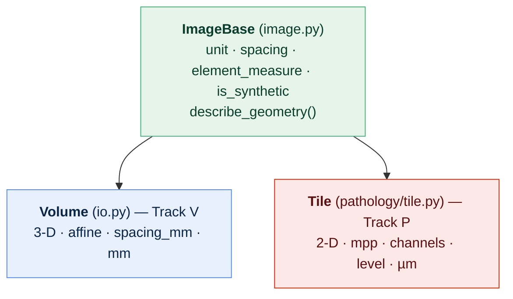
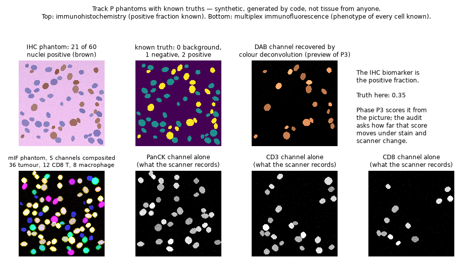
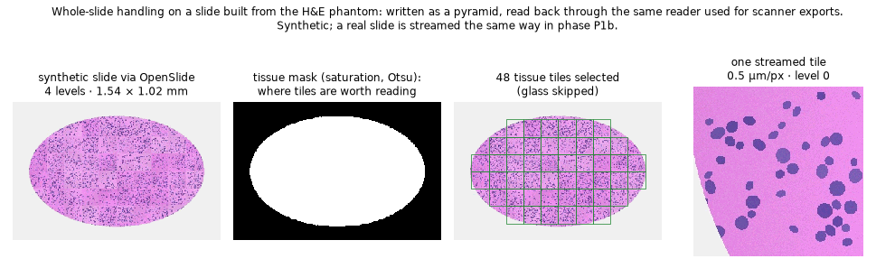

# Phase P1 · Pathology Data and I/O: one geometry rule, three phantoms, and a whole slide

[← Build guide](../../BUILD_GUIDE.md) · [README](../../README.md) · [Glossary](../00-glossary.md) · [Phase P1a](phase-P1a-he-phantom.md) · [Data cards](../data-cards/README.md)

**Prerequisites:** phase P1a complete (`stableseg he-phantom` prints
`2950.875`). For the whole-slide part, the optional pathology extra —
installed in this phase, section 5.
**Learning goal:** after this page you understand why a 3-D volume and a 2-D
tile obey one shared rule, what an immunohistochemistry positive fraction and
a multiplex-immunofluorescence phenotype are and why each phantom knows its
own, what an OME-TIFF carries inside it, why a whole slide is never loaded at
once, and what an optional *extra* is and why the core stays light.
**Time:** about two hours.
**Checkpoint:** `stableseg ihc-phantom` prints `0.35`; `stableseg mif-phantom`
prints `tumour: 36.0`; `stableseg describe-slide` on the synthetic slide
reports its levels and microns-per-pixel; `pytest -q` prints `92 passed`.

**What this phase does not yet contain:** the *real* slide streamed through
the same reader, and the spatial-transcriptomics reader. Both are phase P1b,
the next reply — split from this one so each half is tested and documented
to the standard rather than half-built.

---

## 1. One rule, two worlds

Track V has `Volume`: numbers welded to voxel spacing in millimetres. Track P
has `Tile`: numbers welded to microns per pixel. They are different objects —
a volume has an affine and three axes; a tile has channel names and a pyramid
level — and pretending otherwise would hide exactly the details that matter.

What they share is a **contract**, written once in `src/stableseg/image.py`:

| Every image must answer | Volume says | Tile says |
|---|---|---|
| `unit` — the physical unit of one element | `"mm"` | `"um"` |
| `spacing` — size of one element per axis | `(1.0, 1.0, 1.0)` | `(0.5, 0.5)` |
| `element_measure` — one element's physical size | 1.0 mm³ | 0.25 µm² |
| `is_synthetic` — generated by code? | from its metadata | its flag |

Everyday version: two different tools that fit the same size of socket. Not
the same tool — the same fitting. Any code that needs "how big is one
element, and in what unit" can ask either without knowing which it holds.

**Nothing existing changed.** `Volume` kept its name, fields and import path;
`Tile` likewise; every earlier test passes untouched. That was the point of
writing `Tile` as a mirror of `Volume` in P1a: unification became an
inheritance line, not a rewrite.



---

## 2. The IHC phantom: a known positive fraction

### 2.1 What immunohistochemistry is

H&E shows structure. **Immunohistochemistry (IHC)** shows *one specific
protein*: an antibody binds it, and a brown chromogen — **DAB** — marks
wherever it is. A cell carrying the protein turns brown; one without it stays
blue from the hematoxylin counterstain. Everyday version: a highlighter that
marks one particular word wherever it appears on the page.

The biomarker is the **positive fraction** — the share of cells that are
brown. It decides treatments (HER2 in breast cancer, PD-L1 in several
cancers) and estimates how fast a tumour divides (Ki-67). And it wobbles: a
different antibody batch, a different scanner's colour response, a slightly
different threshold for "brown enough", and the fraction moves.

### 2.2 What the phantom knows

Exactly which nuclei are positive. Positive nuclei get strong DAB and weak
hematoxylin (the brown masks the blue, as it does in real tissue); negatives
get hematoxylin only; and positivity is **graded** — DAB from weak to strong —
because real positivity is, and the H-score measures that gradation.

```bash
stableseg ihc-phantom
```
```json
{ "n_tiles": 8, "mean_positive_fraction_true": 0.35, ... }
```

`data/ihc_phantom/cells.csv` lists every nucleus with its `positive` flag:
the answer key phase P3's positivity scorer is checked against.

The picture is rendered through the same optical-density model as the H&E
phantom, with DAB's stain vector added — so colour deconvolution recovers
the DAB channel from the picture, and it lights up exactly the positive
nuclei (top row of the figure below).

---

## 3. The mIF phantom: every cell's phenotype is known

### 3.1 What multiplex immunofluorescence is

Instead of one brown stain, **several fluorescent dyes at once**, each on its
own antibody, each recorded as its own black-and-white **channel**. Where H&E
gives one picture, mIF gives a stack: DAPI (every nucleus), then one channel
per marker. Everyday version: the same page photographed under five
different coloured lights, each revealing one kind of ink.

A **phenotype** is a cell type defined by which markers it carries — CD3⁺CD8⁺
is a cytotoxic T cell; PanCK⁺ is tumour. Deciding phenotypes from channel
intensities is called **gating**, and density-per-phenotype is among the most
used, and most fragile, pathology biomarkers.

### 3.2 What the phantom knows

The phenotype of every cell, drawn from fixed proportions (45% tumour, 15%
helper T, 15% cytotoxic T, 10% macrophage, 15% other). Each marker channel is
lit only in cells whose phenotype includes it — nucleus plus a thin
cytoplasm halo, since most markers sit on the membrane — and DAPI lights every
nucleus. Five channels, named, saved as **OME-TIFF** with the names and the
microns-per-pixel inside the file.

```bash
stableseg mif-phantom
```
```json
{ "mean_cells_true": 80.0,
  "mean_phenotype_counts_true": { "tumour": 36.0, "T_helper": 12.0, "T_cytotoxic": 12.0, "macrophage": 8.0, "other": 12.0 } }
```



*Top: the IHC phantom, its per-nucleus truth, and the DAB channel that colour
deconvolution recovers from the picture — exactly the positive nuclei.
Bottom: the mIF composite and three of its five channels as a scanner
records them.*

---

## 4. OME-TIFF: geometry inside the file

PNG has no slot for microns per pixel, so the P1a tiles carry a JSON sidecar.
**OME-TIFF** is the microscopy standard that fixes this properly: a TIFF with
a small XML block inside describing the physical pixel size, the channel
names, and the axis order. Everyday version: a photograph with the camera
settings printed on the back rather than on a separate note that can get
lost.

`write_ome_tiff` / `read_ome_tiff` in `src/stableseg/pathology/io.py` write
and read it with lossless compression — the round-trip test checks channel
names, mpp and every pixel are identical. Reading an OME-TIFF that carries no
physical size **refuses**, for the same reason `load_tile` refuses a PNG
without its sidecar: a picture whose size is unknown cannot be measured.

---

## 5. The pathology extra: why the core stays light

### 5.1 What an extra is

Some of Track P needs libraries the core never needs: **OpenSlide**, which
reads the many proprietary whole-slide formats, ships a native library; the
spatial-transcriptomics tools bring HDF5 and zarr. Someone auditing MRI
volumes should not install any of that. So they live in an **optional
extra** — a named group of dependencies you install only if you want them.

Everyday version: the car comes with the engine; the roof rack is an option
you add when you need to carry a bicycle.

Functions that need the extra import it *inside* the function, so the core
package imports and runs without it, and calling a slide function without it
produces one clear message — install this — rather than a stack trace.

### 5.2 Its own lock file

The core's exact versions live in `requirements.lock`. The extra's live in
`requirements-pathology.lock`, resolved in a **clean environment** so the
core pins cannot change and nothing accidental (a plotting library installed
for figures, say) gets captured as if it were a dependency. The procedure is
written at the top of the file and in [`../../CONTRIBUTING.md`](../../CONTRIBUTING.md).

### 5.3 Install it

With the environment active, in the project folder:

```bash
python -m pip install -r requirements-pathology.lock
python -c "import openslide; print('OpenSlide', openslide.__library_version__)"
```

Expected: `OpenSlide 4.x.x`. This works the same on Windows, macOS and RHEL 8
because `openslide-bin` ships the native library as an ordinary wheel — on
RHEL 8 upgrade pip first, as your setup guide says. Platform notes are in each
setup guide's new section, *The pathology extra*.

Two things worth knowing: `tifffile` — used for OME-TIFF and pyramids — is
**already in the core** (scikit-image depends on it), so the mIF phantom works
without the extra; and the automated checks install the extra on all six
platform combinations, so the slide reader is verified everywhere. Without
it, the five slide tests skip with a message rather than fail.

---

## 6. Whole slides: never all at once

### 6.1 What a whole-slide image is

A glass slide scanned at full resolution is a picture around 100,000 pixels
on a side — several gigabytes, more than most laptops hold in memory. So it is
stored as a **pyramid**: the full picture, a half-size copy, a quarter-size
copy, and so on, cut into **tiles**. A viewer shows the small copy for the
overview and fetches full-resolution tiles only for the part you zoom into.
Everyday version: a map service — the whole planet exists, but you only ever
download the tiles for the street you are looking at.

The project's audit runs on tiles for exactly this reason: it keeps the tool
CPU-first and laptop-sized. But it must *demonstrate* reading a real slide
and streaming tiles from it, and this section builds that.

### 6.2 Tested without downloading a slide

`write_pyramidal_tiff` writes an RGB picture as a tiled, multi-resolution
TIFF with resolution tags encoding the microns per pixel. **OpenSlide reads
that file through the same generic-TIFF path it uses for scanner exports** —
so a slide built from tiled H&E phantoms exercises the reader that will meet
a real scanner file in P1b, with geometry and pixels known exactly.

```mermaid
flowchart LR
    A["tiled H&E phantoms<br/>on a glass-white oval"] -->|"write_pyramidal_tiff<br/>levels as pages, resolution tags"| B["📁 slide.tif<br/>pyramid"]
    B -->|"OpenSlide<br/>(generic-tiff reader)"| C["Slide<br/>mpp · levels · downsamples"]
    C --> D["thumbnail →<br/>tissue mask (saturation, Otsu)"]
    D --> E["iter_tiles: only tiles<br/>mostly on tissue"]
    E --> F["Tile · Tile · Tile<br/>each with mpp and origin"]
    classDef a fill:#FDE8E8,stroke:#CC3311,color:#5A1010;
    classDef b fill:#FFF3CD,stroke:#C9A227,color:#4A3B00;
    classDef c fill:#E6F4EA,stroke:#4CAF7D,color:#0B3D2E;
    class A,F a
    class B b
    class C,D,E c
```



### 6.3 The reader

`Slide` in `pathology/io.py` wraps OpenSlide and states its conventions:

- `mpp` is read from the file and **refuses to guess** when absent.
- `level_dimensions` are *(width, height)* — OpenSlide's order, the reverse
  of NumPy's; the docstring says so because everyone gets bitten once.
- `read_tile(x, y, size, level)` addresses every tile by **level-0
  coordinates** whatever level is read — OpenSlide's convention, convenient
  once known and a trap before.
- `tissue_mask()` thresholds the thumbnail's colour saturation (Otsu's
  method picks the threshold from the image): glass is white and unsaturated,
  stained tissue has colour. A heuristic for choosing tiles, not a
  segmentation — phase P3 owns that. Consequence: a uniformly grey picture
  has no saturation and is "no tissue", which is right for a blank slide.
- `iter_tiles(size, level, tissue_only, min_tissue_fraction, limit)` walks
  the grid and yields only tiles mostly on tissue, up to a cap — the cap is
  what keeps a demonstration to seconds.

```bash
stableseg describe-slide <slide>
stableseg slide-tiles <slide> --out runs/slide-tiles --limit 32
```



*A 3 mm-wide synthetic slide: read back through OpenSlide with four levels;
the tissue mask; the 48 tiles selected (glass skipped); one streamed tile at
the tissue edge, carrying its mpp and origin.*

---

## 7. The files

| File | Role |
|---|---|
| `src/stableseg/image.py` | `ImageBase`: the shared geometry contract |
| `src/stableseg/io.py` | `Volume` now inherits it — nothing else changed |
| `src/stableseg/pathology/tile.py` | `Tile` now inherits it — nothing else changed |
| `src/stableseg/pathology/phantom.py` | `render_stains` (any stains, OD model), `_place_nuclei` shared, the IHC and mIF generators and dataset writers |
| `src/stableseg/pathology/io.py` | OME-TIFF write/read, `write_pyramidal_tiff`, `Slide` with tissue mask and tile iteration |
| `src/stableseg/config.py` | `IHCPhantomSpec`, `MIFPhantomSpec`; two new `data.source` values |
| `src/stableseg/api.py` · `cli.py` | `ihc-phantom`, `mif-phantom`, `describe-slide`, `slide-tiles` |
| `configs/ihc_phantom.yaml` · `configs/mif_phantom.yaml` | the experiments as documents |
| `pyproject.toml` | the `[pathology]` extra |
| `requirements-pathology.lock` | its exact pins, resolved in a clean environment |
| `.github/workflows/ci.yml` | installs the extra, so slide tests run on all six jobs |
| `tests/test_pathology_io.py` | 16 checks; 5 skip without OpenSlide |
| `scripts/make_figures.py` | the two figures above |

---

## 8. What could go wrong

| Symptom | Cause | Fix |
|---|---|---|
| `openslide is not installed. This needs the optional pathology extra` | extra not installed | section 5.3 |
| `pip` refuses `openslide-bin` on RHEL 8 | old pip cannot read the wheel's platform tag | `python -m pip install --upgrade pip`, then retry |
| `... carries no microns-per-pixel` | the TIFF has no resolution tags | supply mpp from the scanner's metadata, or use a file that carries it — the tool will not guess |
| `slide-tiles` writes 0 tiles | no colour saturation on the thumbnail (blank or grey) | expected for glass; check the slide has stained tissue |
| `mif-phantom` fails with an `ImportError` about tifffile | environment out of step with the lock | `python -m pip install -r requirements.lock` |
| `pytest` shows `5 skipped` | OpenSlide absent | fine — install the extra to run them |

---

## 9. Commit the phase

```bash
git switch develop
git add -A
git commit -m "phase P1: shared geometry base, IHC and mIF phantoms, OME-TIFF and pyramidal TIFF I/O, OpenSlide reader, pathology extra with lock"
git push origin develop develop:beta develop:master

## --tags is optional, only when required
## then switch back to local master and pull in the remote changes

git switch master
git pull --ff-only origin master
git switch develop
```

---

Next: phase P1b — the real slide streamed through this reader, the
spatial-transcriptomics reader, and the registry entries for the pathology
datasets — then [Track V's perturbation bank](../../BUILD_GUIDE.md), phase V3.
