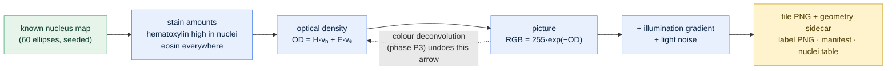
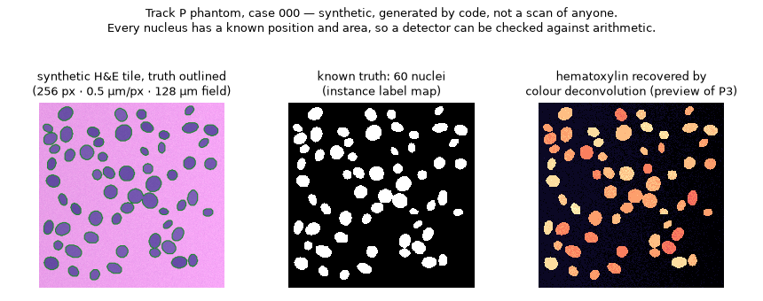

# Phase P1a · The Synthetic H&E Phantom: Track P's first code

[← Build guide](../../BUILD_GUIDE.md) · [README](../../README.md) · [Glossary](../00-glossary.md) · [Roadmap](../05-roadmap.md) · [Phase 1](phase-01-skeleton.md)

**Prerequisites:** phase 1 complete (the project installs, `pytest -q` passes,
`stableseg phantom` prints `2269.75`). Nothing pathology-specific: this page
teaches it.
**Learning goal:** after this page you know what a stained tissue slide is,
why nuclei look purple, why stains are mixed in optical density rather than
brightness, and how a tile with a known number of nuclei is built and
verified — and you will have Track P's first reference number on your screen.
**Time:** about one hour.
**Checkpoint:** `stableseg he-phantom` prints `"mean_true_nuclei": 60.0` and
`"mean_nuclear_area_um2": 2950.875`; `pytest -q` prints `92 passed`.

---

## 1. Why a phantom, again

Track V began with a synthetic MRI phantom before touching a real scan
([phase 1, section 5](phase-01-skeleton.md)). Track P begins the same way, for
the same three reasons:

1. **Every test must run anywhere, in seconds, with nothing downloaded.** The
   real pathology datasets are gigabytes and some need an account.
2. **A phantom has an answer key.** A real tile has a pathologist's opinion
   about how many nuclei it contains. A phantom has arithmetic: the code drew
   sixty nuclei, so there are sixty. When phase P3 builds a nucleus detector,
   this is what it is checked against before anyone trusts it on tissue.
3. **It is reproducible.** Same seed, same tile, on every machine, for ever.

The everyday version is the same as before: the 1 kg calibration weight you
put on a kitchen scale. You do not care about the weight. You are checking the
scale.

---

## 2. What you are looking at: a stained tissue slide, from zero

### 2.1 Tissue is transparent

A slice of tissue thin enough to see through — a few thousandths of a
millimetre — is almost colourless. To see anything, pathologists **stain** it:
they apply dyes that bind to particular components.

### 2.2 H&E: the two-colour highlighter

The standard stain for over a century is **H&E**: **hematoxylin** binds to the
genetic material in cell **nuclei** and colours them blue-purple; **eosin**
binds to proteins in the surrounding **cytoplasm** and colours it pink.

Everyday version: highlighting a document with two colours — one for the
headings (nuclei), one for the body text (everything else). A pathologist
reading a slide reads the headings first: how many nuclei, how big, how
crowded, how irregular.

### 2.3 Pixels have a physical size here too

A scanner records the slide as a picture. Each pixel covers a real distance,
recorded as **microns per pixel (mpp)** — a micron being a thousandth of a
millimetre. At 0.5 mpp (a "20×" scan), a nucleus eight pixels across is 4 µm
wide; at 0.25 mpp ("40×") the same nucleus is sixteen pixels. Count pixels
without the mpp and every area is wrong by a factor of four.

This is the pathology twin of the rule Track V lives by
([the voxel-spacing figure](../../BUILD_GUIDE.md#21-a-scan-is-a-stack-of-pictures-and-each-cube-has-a-size)):
**the numbers and their physical size travel together, always.**

---

## 3. Why colour is mixed in optical density, not brightness

This is the one idea in this phase that is not obvious, and it matters for
everything Track P does afterwards.

A stain does not *add* colour to light. It **absorbs** some of it. Where
hematoxylin and eosin overlap, each removes its share of the light passing
through — and shares **multiply**: if one lets 50% through and the other 40%,
together they let 20% through, not 10%.

Multiplication is awkward. So the field works in **optical density (OD)**:
the negative logarithm of the fraction of light transmitted. Logarithms turn
multiplication into addition, and now two stains simply add:

```
OD_pixel  =  amount_of_hematoxylin × colour_of_hematoxylin
           + amount_of_eosin       × colour_of_eosin

picture   =  255 × exp(−OD_pixel)
```

The "colour of" each stain is its **stain vector** — a fixed direction in OD
space, measured once (Ruifrok & Johnston, 2001) and used by scikit-image's
colour deconvolution. Everyday version: stacking two coloured filters in front
of a lamp. Each filter blocks a fraction; the fractions multiply; take a
logarithm and they add.



**Why build the phantom this way rather than just painting purple ellipses?**
Because two later phases depend on it. Phase P3's classical nucleus detector
is **colour deconvolution** — undoing the OD mixing to read off "how much
hematoxylin is here". A phantom built in the same model gives it a known
truth to recover. And phase P2's stain perturbations are shifts of the stain
vectors in OD space — the quantity that *actually* varies between
laboratories — so the phantom is perturbed in the same currency real tissue
varies in.

---

## 4. What the generator produces

```bash
stableseg he-phantom
```

```json
{
  "data_root": ".../data/he_phantom",
  "n_tiles": 8,
  "manifest": ".../data/he_phantom/manifest.csv",
  "run_dir": ".../runs/he-phantom-smoke",
  "mean_true_nuclei": 60.0,
  "mean_nuclear_area_um2": 2950.875
}
```

**`2950.875` is Track P's checkpoint**, the twin of Track V's `2269.75`. It
is the mean total nuclear area per tile, in square microns, over the eight
default tiles — identical on every machine, because the generator is seeded
per tile. If you see it, your install reproduces the reference tile set
exactly.



*Tile 000: the picture with the truth outlined; the known truth (60 nuclei);
and what colour deconvolution recovers from the picture alone — every
nucleus, which is the proof that the phantom lives in the same optical-density
model the deconvolution assumes.*

What landed on disk:

| Path | What it holds |
|---|---|
| `data/he_phantom/images/he_phantom_000.png` | the picture, 256 × 256 RGB, lossless |
| `data/he_phantom/images/he_phantom_000.json` | its geometry: `mpp`, channel names, level, `synthetic: true` |
| `data/he_phantom/labels/he_phantom_000.png` | the label map: 0 = background, 1…60 = each nucleus |
| `data/he_phantom/manifest.csv` | one row per tile: nucleus count, nuclear area, mpp, `synthetic` |
| `data/he_phantom/nuclei.csv` | one row per nucleus: centre, semi-axes in microns, orientation, area |
| `runs/he-phantom-smoke/run.json` | the provenance stamp, with `"modality": "pathology"` |

Reading a filename: `he_phantom` = generated, H&E-styled; `000` = tile number,
zero-padded; `.png` because it is **lossless** — what is written is what is
read back, which every reproducibility check depends on. (JPEG would silently
change pixels; that is one of the disturbances phase P2 applies *on purpose*,
so it must never happen by accident.)

**Why a sidecar file?** PNG has no standard slot for microns per pixel. Rather
than lose the geometry or hide it in a filename, it lives in a small JSON
beside the picture, and `load_tile` **refuses** to open a picture without one.
A picture whose physical size is unknown cannot be measured, so the code
declines to guess. Phase P1 adds OME-TIFF, which carries geometry inside the
file.

---

## 5. The files, one by one

### 5.1 `src/stableseg/pathology/tile.py` — the Tile

Track P's `Volume`. An array `(height, width, channels)` welded to its `mpp`,
its channel names, its pyramid `level` and a `synthetic` flag. Two properties
do the arithmetic once so nobody repeats it wrongly: `pixel_area_um2`
(mpp²) and `field_um` (the tile's physical width and height).

Three refusals, each a real mistake caught early: mismatched channel names,
a non-positive mpp, and loading a picture without its sidecar.

### 5.2 `src/stableseg/pathology/phantom.py` — the generator

`render_he()` is the optical-density model from section 3, kept public
because phases P2 and P7 call it with different inputs.
`generate_he_phantom()` places non-overlapping ellipses by rejection sampling
(draw a trial ellipse; if it touches an existing nucleus, throw it away), assigns
stain amounts, renders, and returns the tile, the label map and the truth
table. `generate_he_phantom_dataset()` writes the folder layout — `images/`
and `labels/` paired by filename, the same layout the real datasets use, so
the loader written for phantoms reads real tiles unchanged.

### 5.3 `src/stableseg/config.py` — `HEPhantomSpec`

Mirrors `PhantomSpec`. Note the units: `nucleus_radius_um` is in **microns**,
and the pixel size follows from `mpp`. Keeping the physical number in the
settings is what makes the same experiment comparable across magnifications.
`data.source` gains the value `he_phantom`; nothing existing changes, and
`configs/phantom.yaml` still validates.

### 5.4 `src/stableseg/api.py` and `cli.py`

`generate_he_phantoms()` and `describe_tile()` in the API; `he-phantom` and
`describe-tile` on the command line. The command resolves its configuration
the same three-step way `phantom` does since 0.1.1 — explicit `--config`, else
`configs/he_phantom.yaml` in the current folder, else built-in defaults — so
it works on an installed copy from any empty folder.

### 5.5 `tests/test_he_phantom.py` — sixteen checks

Mirroring `test_phantom.py`: geometry survives a round trip; loading without
geometry refuses; the stain vectors are unit length; more hematoxylin means
darker *and* bluer; same seed, same tile; the label map agrees with the truth
table nucleus by nucleus; nuclei never overlap; sizes respect the micron
range; and the default set reproduces `2950.875`. Two more in `test_cli.py`
run the command from an empty folder the way an installed user would.

---

## 6. Do it yourself

```bash
cd ~/projects/stableseg          # Windows: cd $HOME\projects\stableseg
source .venv/bin/activate        # Windows: .\.venv\Scripts\Activate.ps1

stableseg he-phantom             # expect mean_true_nuclei 60.0, mean_nuclear_area_um2 2950.875
stableseg describe-tile data/he_phantom/images/he_phantom_000.png
```

The second command prints the tile's geometry — `mpp: 0.5`, channels
`R, G, B`, `pixel_area_um2: 0.25`, `field_um: [128, 128]`, `synthetic: true`.

Then, in Python, prove the answer key to yourself:

```python
from stableseg.pathology.tile import load_label_tile
import pandas as pd

labels = load_label_tile("data/he_phantom/labels/he_phantom_000.png")
print(labels.max())                                   # 60 — sixty nuclei
print((labels > 0).sum() * 0.5 * 0.5)                 # nuclear area in µm² ...
print(pd.read_csv("data/he_phantom/manifest.csv").loc[0, "nuclear_area_um2"])  # ... equals the manifest
```

And run the checks:

```bash
pytest -q                        # 92 passed
```

---

## 7. What could go wrong

| Symptom | Cause | Fix |
|---|---|---|
| `mean_nuclear_area_um2` is not `2950.875` | different NumPy version changed the random stream | `python -m pip install -r requirements.lock --force-reinstall`; if it persists, report it with your `pip freeze` |
| `FileNotFoundError: ... has no geometry sidecar` | a PNG was copied without its `.json` | copy both files together; a picture without its mpp cannot be measured |
| `ValueError: ... channel planes but ... channel names` | a Tile was built with the wrong channel list | one name per plane: `("R","G","B")` for RGB, `("gray",)` for one plane |
| `Invalid value for '--config'` | the path does not exist | omit `--config` to use defaults, or check the path |
| tiles look identical across `tile_index` | generator not seeded per tile | it is: `np.random.default_rng([seed, tile_index])`; if you edited it, restore that line |

---

## 8. What you learned

What a stained slide is and what H&E shows. Why pathology has a "voxel
spacing" called microns per pixel. Why stains are mixed in optical density and
how a logarithm turns multiplication into addition. How a known-truth tile is
built so a detector can be checked against arithmetic. And the shape of every
Track P phase to come: same layering, same storage, same provenance, same
insistence that numbers never travel without their geometry.

---

## 9. Commit the phase

```bash
git switch develop
git add -A
git commit -m "phase P1a: synthetic H&E phantom - tile abstraction, OD-model generator, config, API, CLI, tests, figure"
git push origin develop develop:beta develop:master

## --tags is optional, only when required
## then switch back to local master and pull in the remote changes

git switch master
git pull --ff-only origin master
git switch develop
```

---

Next: back to the [build guide](../../BUILD_GUIDE.md), section 8 — Track V's
real MRI data (phase V2), then Track P's readers and remaining phantoms
(phase P1).
