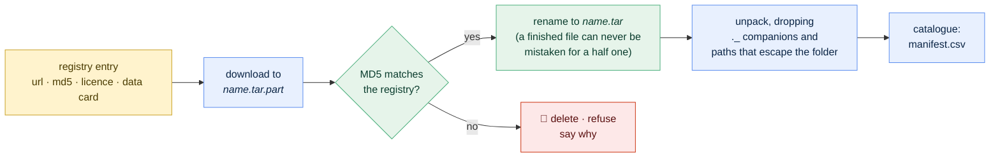
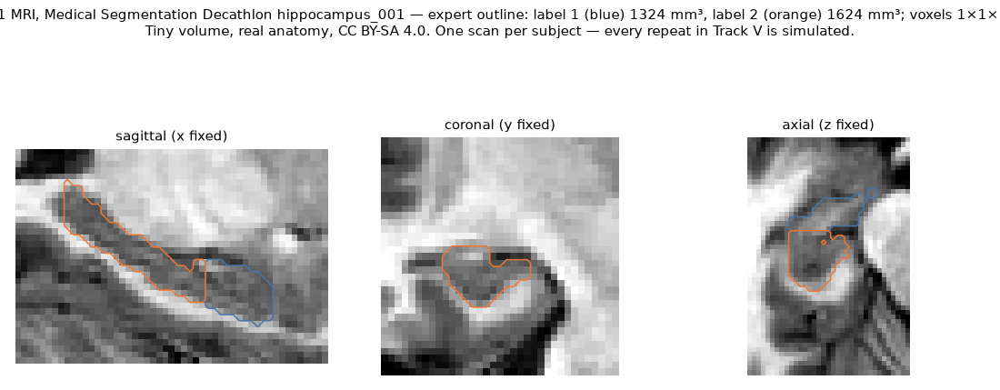
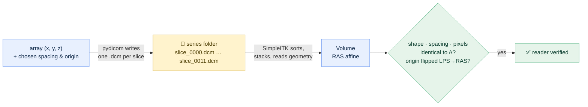

# Phase V2 · Real Data: the hippocampus MRI, and the hospital format

[← Build guide](../../BUILD_GUIDE.md) · [README](../../README.md) · [Glossary](../00-glossary.md) · [Data card](../data-cards/msd-hippocampus.md) · [Phase 1](phase-01-skeleton.md)

**Prerequisites:** phase 1 complete; an internet connection for one 27 MB
download.
**Learning goal:** after this page you can fetch a public medical dataset the
safe way — verified, not trusted — catalogue it, read a real brain scan, and
read the format hospitals actually use. You will also understand why a
checksum matters, why an archive can lie about its own contents, and why
DICOM and NIfTI disagree about which way is left.
**Time:** about ninety minutes, including the download.
**Checkpoint:** `stableseg fetch msd_task04_hippocampus` ends with
`"MD5 verified"`; `stableseg dataset-summary` reports the case counts; the
real-scan figure exists in `docs/img/`; `pytest -q` prints `74 passed`.

---

## 1. Why now, and what "real" changes

Everything so far ran on phantoms — generated data with a known answer. That
was the right start: the tests run anywhere and the pipeline is checked
against arithmetic. But the audit question is only *meaningful* on real
anatomy, and the next phase — the perturbation bank — needs a real image to
disturb. A noise level that looks plausible on a generated ellipsoid may be
absurd on a brain.

So this phase brings in the first real scans, and with them three things
phantoms never made you deal with:

- **Trust.** A file you downloaded is a file someone else made. How do you
  know it is the file they published, intact?
- **Mess.** Real archives carry junk — hidden files, odd layouts, a folder
  structure you did not design.
- **The hospital format.** Research datasets use NIfTI. Hospitals use DICOM,
  and if the tool cannot read DICOM it cannot meet data where it lives.

---

## 2. The dataset

The **Medical Segmentation Decathlon, Task04 Hippocampus**: small MRI volumes
cropped around the hippocampus, with expert outlines of its two parts. Real
brains, de-identified, CC BY-SA 4.0, about 27 MB. Everything about it —
source, licence, size, what it can and cannot show — is on its
[data card](../data-cards/msd-hippocampus.md), which was written before the
download script, as every dataset's is.

**What it cannot show, said once more because it matters most:** each subject
was scanned **once**. There is no real repeat visit. Every "rescan" in Track V
is simulated by the perturbation bank, and every Track V number carries that
caveat. (Track P has a real test–retest; see the
[PLISM card](../data-cards/plism.md).)

---

## 3. Fetching it the safe way

### 3.1 What a checksum is

A **checksum** — here **MD5** — is a fingerprint computed from every byte of a
file: a fixed-length string that changes completely if a single byte changes.
The authors' file has one fingerprint. If your download has the same
fingerprint, you have their file, byte for byte. If not, you do not — the
download was truncated, a bit flipped, or the file on the server was
replaced.

Everyday version: a parcel with a seal. You do not open a parcel whose seal is
broken; you send it back. The fetch command **deletes** an archive whose
fingerprint does not match, and says so. It never keeps it.



### 3.2 Where the URL and fingerprint come from

They live in a **registry** — `src/stableseg/datasets.py` — one entry per
dataset, with the URL, the MD5, the licence and the path of the data card.
The MD5 for this archive is the one the MONAI project's own dataset loader
verifies against, checked against their published source rather than
remembered. A test (`test_registry_entries_are_complete`) refuses any entry
whose data card does not exist or whose licence is blank.

### 3.3 Do it

```bash
stableseg datasets
```
Lists what can be fetched, with licence and card. Then:

```bash
stableseg fetch msd_task04_hippocampus
```

A progress line ticks up to about 27 MB, then:

```json
{
  "dataset": "msd_task04_hippocampus",
  "title": "Medical Segmentation Decathlon - Task04 Hippocampus",
  "license": "CC BY-SA 4.0",
  "data_card": "docs/data-cards/msd-hippocampus.md",
  "archive": ".../data/Task04_Hippocampus.tar",
  "root": ".../data/Task04_Hippocampus",
  "steps": ["downloaded Task04_Hippocampus.tar", "MD5 verified", "unpacked to Task04_Hippocampus"]
}
```

**`"MD5 verified"` is the checkpoint.** Run the command again and the steps
read `archive already present and verified`, `already unpacked` — nothing is
downloaded twice. That property is called **idempotence**: doing it again
changes nothing. It is what lets a setup script be re-run without fear.

### 3.4 The mess it handled for you

Two things happened during unpacking that you did not see:

**Hidden companions.** Archives made on a Mac carry a `._name` file beside
every real file — a leftover of how macOS stores extra attributes. This
archive has hundreds. They are *named* like scans and are not scans; a loader
that picks them up crashes or, worse, counts them. The unpacker drops them.

**Escaping paths.** A malicious archive can contain an entry named
`../../something`, which would write outside the folder you chose. The
unpacker refuses any such entry. This dataset has none; the check exists
because a tool that reads archives from the internet must never assume that.

---

## 4. Cataloguing what arrived

```bash
stableseg dataset-summary data/Task04_Hippocampus --manifest runs/msd-manifest.csv
```

```json
{
  "n_cases": 390,
  "n_with_labels": 260,
  "n_train": 260,
  "n_test": 130,
  "spacing_x_mm_min": 1.0, "spacing_x_mm_max": 1.0,
  "shape_x_min": 31,      "shape_x_max": 43,
  ...
}
```

Your exact numbers are the truth; paste them into the
[data card](../data-cards/msd-hippocampus.md) if they differ from what it
says. Two things to read from this before anything else:

- **Spacing.** Every voxel is 1 mm on each side in every case. That is the
  single most useful thing to know about a new dataset, because a dataset
  whose spacing *varies* is one whose volumes must be compared in
  millimetres, never in voxels. The catalogue reads it from every file's
  header so you never assume it.
- **Shapes vary** (31 to 43 voxels along x, and similarly on the other axes):
  the volumes are cropped around the structure, each to its own size. Phase
  V4's preprocessing resamples them to a common grid.

The catalogue understands two folder layouts — this project's `images/` +
`labels/`, and the Decathlon's `imagesTr/` + `labelsTr/` + `imagesTs/` — and
pairs image with outline by identical filename, the convention every public
imaging dataset here follows. Unlabelled test scans are kept, labelled as
`split: test`, because a scan without an outline is still a scan the audit
can perturb and measure.

---

## 5. Looking at a real scan

```bash
stableseg describe data/Task04_Hippocampus/imagesTr/hippocampus_001.nii.gz
```

```json
{
  "shape": [35, 51, 35],
  "spacing_mm": [1.0, 1.0, 1.0],
  "voxel_volume_mm3": 1.0,
  "min": 0.0, "max": 1211.0, "mean": 251.1,
  ...
}
```

The intensity range is arbitrary — MRI has no fixed physical scale, unlike CT
— which is why phase V4 normalises intensities before anything compares
them.

Now the outlines. The expert traced two parts, labelled 1 and 2:

```python
from stableseg.io import load_volume, label_volume_mm3
lbl = load_volume("data/Task04_Hippocampus/labelsTr/hippocampus_001.nii.gz")
print(label_volume_mm3(lbl, 1), label_volume_mm3(lbl, 2))
```

Two volumes in cubic millimetres — the first real biomarker values in the
project. Note that they are an **expert's opinion**, not arithmetic: unlike a
phantom, nobody knows the true volume of a real hippocampus. That is why
phantoms exist and why the statistics are about *repeatability*, not
accuracy.

### 5.1 The first real figure

```bash
python scripts/make_figures.py
```

The figure script now produces `docs/img/msd_hippocampus_case.png` — a real
scan in three orthogonal views with the expert outline — **and it can only do
so on a machine that has fetched the data**, which is why this figure is
generated by you, not shipped. Confirm it exists:

```bash
ls docs/img/msd_hippocampus_case.png
```

**This file is committed with the phase** (section 9); until it is, the
README's link to it is broken. On a fresh clone without the data the script
skips this figure with a message rather than failing, so the other figures
still regenerate.



---

## 6. The hospital format: DICOM

### 6.1 One file per slice, and a header the size of a form

NIfTI stores a whole scan in one file with its geometry in one header. **DICOM**
— the standard every hospital scanner and archive uses — stores **one file per
slice**, each with a header of hundreds of **tags**: patient, scanner,
position in space, pixel size, and much more. A scan is therefore a *folder*
of files that must be sorted into order and stacked, with the geometry
reassembled from tags spread across them.

Everyday version: NIfTI is a bound book; DICOM is a box of loose pages, each
stamped with its page number and a form on the back.

### 6.2 Which way is left

DICOM describes space as **LPS**: x increases toward the patient's **L**eft,
y toward **P**osterior (the back), z toward **S**uperior (the head). NIfTI
convention is **RAS**: **R**ight, **A**nterior, **S**uperior. The two differ
by flipping the first two axes.

Ignore this and a DICOM-read scan and a NIfTI-read scan of the same patient
sit in mirror-image coordinate frames — the brain's left becomes right. The
reader converts to RAS, so every scan in the project lives in one frame and
downstream code never knows which format it came from.

### 6.3 Tested without any patient

There is no public DICOM in this project and there should not be — real DICOM
carries patient identity. Instead, `write_synthetic_series` builds a valid
series from scratch with **pydicom** (patient name `ANONYMOUS`, generated
identifiers, modality MR), and `read_series` reads it back with **SimpleITK**.
Two independent implementations of the standard agreeing on shape, spacing
and origin, with no patient anywhere — the reader's answer key, the same role
the phantoms play.



Try it:

```bash
python -c "
import numpy as np
from stableseg.dicom import write_synthetic_series
write_synthetic_series('runs/demo-series', np.zeros((8, 8, 4), dtype=np.uint16), spacing_mm=(1.0, 1.0, 2.5))"
stableseg dicom-to-nifti runs/demo-series runs/demo.nii.gz
```

The output describes the NIfTI just written: `"spacing_mm": [1.0, 1.0, 2.5]`
— the spacing you chose, recovered through a write in one library and a read
in another.

The reader refuses a folder containing **two** series rather than silently
merging them: hospital exports put one series per folder, and a tool that
guesses which slices belong together is a tool that will one day stack the
wrong ones.

---

## 7. The files

| File | Role |
|---|---|
| `src/stableseg/datasets.py` | the registry; `download` (to a `.part` name, renamed on completion), `md5_of`/`verify_md5`, `extract_archive` (drops `._` companions, refuses escaping paths), `fetch` (idempotent: download → verify → unpack) |
| `src/stableseg/dicom.py` | `read_series` (SimpleITK, LPS→RAS), `write_synthetic_series` (pydicom, no patient), `series_to_nifti` |
| `src/stableseg/io.py` | `scan_dataset_folder`: both layouts, filename pairing, header-only geometry |
| `src/stableseg/api.py` | `fetch_dataset`, `list_datasets`, `dataset_summary`, `dicom_to_nifti` |
| `src/stableseg/cli.py` | `datasets`, `fetch`, `dataset-summary`, `dicom-to-nifti` |
| `configs/msd_hippocampus.yaml` | points later phases at the fetched data |
| `tests/test_datasets_and_dicom.py` | 17 checks, no network: the fetch path runs against a tar built on the spot and served through a `file://` URL |
| `scripts/make_figures.py` | `fig_msd_case`, skipped when the data is absent |

**On the test that fetches without a network.** The downloader uses the
standard library, which accepts `file://` URLs as well as `https://`. So the
tests build a small Decathlon-shaped archive — two phantoms, with `._` junk
added on purpose — register it under a temporary key with its real MD5, and
run the *same* `fetch` code the real download uses: verification, refusal on
a wrong fingerprint (the archive is deleted), unpacking, junk filtering,
idempotence. The network is the only thing not tested, and it is the only
thing that cannot be.

---

## 8. What could go wrong

| Symptom | Cause | Fix |
|---|---|---|
| `MD5 does not match ... Deleted.` | truncated download, or the published file changed | run `fetch` again; if it fails twice, the file on the server has changed — check the data card and the MONAI project's registry before touching the expected value |
| `URLError` / `Connection` errors | no network, or a proxy | check connectivity; behind a corporate proxy set `HTTPS_PROXY` |
| `neither images/ nor imagesTr/` | pointed at the wrong folder | the root is `data/Task04_Hippocampus`, the folder *containing* `imagesTr/` |
| `no DICOM series found` | folder has no `.dcm` files, or they are not DICOM | check with `ls`; a DICOM file starts with 128 bytes then `DICM` |
| `2 DICOM series in ...` | two exports in one folder | one series per folder |
| the figure script says SKIPPED | data not fetched | section 3.3 |
| `docs/img/msd_hippocampus_case.png` missing after `make_figures` | matplotlib not installed | `python -m pip install matplotlib` (a documentation tool, not a project dependency) |

---

## 9. Commit the phase — including the figure you generated

```bash
ls docs/img/msd_hippocampus_case.png     # must exist before committing

git switch develop
git add -A
git commit -m "phase V2: real data - verified dataset fetch, folder catalogue, DICOM reader with synthetic series, first real-scan figure"
git push origin develop develop:beta develop:master

## --tags is optional, only when required
## then switch back to local master and pull in the remote changes

git switch master
git pull --ff-only origin master
git switch develop
```

The dataset itself stays out of the repository (`data/` is ignored); the
figure, the code and the catalogue script go in.

---

Next: back to the [build guide](../../BUILD_GUIDE.md), section 8b — Track P's
readers and remaining phantoms (phase P1).
