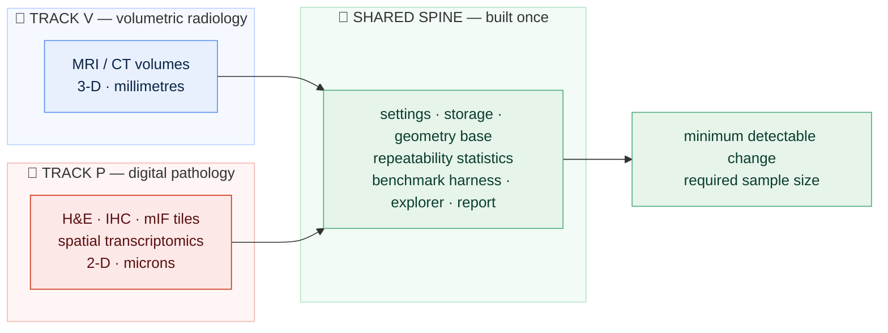
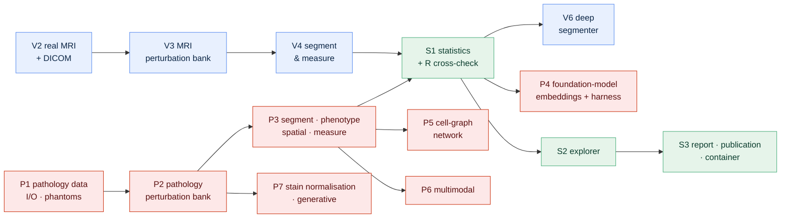

# 05 · Roadmap: what comes after 0.1.x, on both tracks

[← README](../README.md) · [Build guide](../BUILD_GUIDE.md) · [Glossary](00-glossary.md) · [Architecture](02-architecture.md) · [Product roadmap](06-product-and-technology-roadmap.md)

**Prerequisites:** none, though [`02-architecture.md`](02-architecture.md) makes
the phase names mean something.
**Learning goal:** after this page you know what is built, what is not, in what
order the rest arrives on **both tracks**, and — more useful than the list
itself — *why* that order. Sequencing work across two parallel tracks that
share a spine is a skill, and this page shows the reasoning rather than just
the outcome.
**Checkpoint:** you can say which pathology phase must come before the
foundation-model benchmark, why the statistics module is built exactly once,
and what the parity rule forbids.

---

## 1. Why a roadmap is part of the project, not a marketing page

Two reasons, and both are practical.

**It is a promise you can be held to.** A project that says "coming soon" about
everything is unfalsifiable. A project that says "0.2.0 ships the radiology
perturbation bank *and* the pathology perturbation bank, both feeding one
statistics module" can be checked against reality later. Writing it down makes
the work honest.

**It stops you building the wrong thing next.** Everyone's instinct on a
project like this is to build the interesting part first — the neural network,
the foundation model, the dashboard. All three would have been mistakes here,
for reasons explained below. Deciding the order once, in writing, means you do
not re-litigate it every weekend.

Think of it like building a house with two wings on one foundation. The
instinct is to choose the kitchen worktop, because that is the part you can
picture. But the foundation, the frame and the plumbing come first — and when
two wings share plumbing, the plumbing is built once, in the middle, before
either wing's walls go up.

---

## 2. Where the project stands: version 0.1.x

**Released.** Everything below works, is tested, and runs on Windows, macOS
and Linux with Python 3.12 or 3.13.

| What exists | Where |
|---|---|
| Installable package with a strict layering rule (`cli → api → core`) | `src/stableseg/` |
| One validated settings file describes one run | `config.py`, `configs/phantom.yaml` |
| Storage layer with a provenance stamp on every run | `storage.py` |
| 3-D image loading that never separates the numbers from their geometry | `io.py` |
| The first biomarker: label volume in cubic millimetres | `io.label_volume_mm3` |
| Deterministic synthetic MRI phantom generator with known true volumes | `phantom.py` |
| Command-line tool: `version`, `describe`, `phantom`, `validate-config` | `cli.py` |
| 74 automated checks, no download needed, under a second | `tests/` |
| Automated checks on 3 operating systems × 2 Python versions | `.github/workflows/ci.yml` |
| Pre-push safety check for credentials, oversized files, private paths | `scripts/preflight.py` |
| R toolchain verified against the Python reference value | `R/verify_setup.R` |
| The complete beginner tutorial, with illustrations | `docs/`, `BUILD_GUIDE.md` |

**What does not exist yet.** No real scan has been loaded, on either track.
Nothing has been perturbed, segmented or measured. There is no statistics
module, no app, no report. Version 0.1.x is the frame of the house, not the
house.

That is deliberate and worth defending: every later phase — on both tracks —
writes its outputs through the storage layer, describes itself in the settings
file, and is driven through the same function layer. Building those first
means no phase has to be rewritten when the next one arrives.

---

## 3. Two tracks, one spine

From 0.2.0 onward the project has two equal tracks and a shared spine. The
thesis is identical on both: *how much does an imaging biomarker move when the
sample has not changed?*



| Track | What the picture is | What is measured | Why it is here |
|---|---|---|---|
| **V — Volumetric radiology** | MRI and CT volumes: 3-D stacks of slices in millimetres (NIfTI, DICOM) | volume, surface area, shape of a traced structure | the original question: scan–rescan repeatability of a trial endpoint such as hippocampal volume |
| **P — Digital pathology** | H&E, IHC and multiplex-immunofluorescence tiles and whole-slide images; spatial-transcriptomics spots: 2-D pictures in microns | tissue fractions, cell densities per phenotype, IHC positivity, spatial statistics, cell-graph scores, foundation-model embeddings | the same question at cell scale: the same slide, restained or rescanned elsewhere, gives a different number — and every model inherits that wobble |
| **S — Shared spine** | — | the *same* statistics: ICC, within-subject CV, Bland–Altman, repeatability coefficient, minimum detectable change, sample size | one implementation, cross-checked once in R, serving both tracks |

**The parity rule.** The two tracks carry equal weight in every artefact —
README, architecture, glossary, roadmap, checks, explorer, report, changelog.
Every release ships a comparable increment on both. If a piece of work would
be too large to give both tracks their due, it is split; length pressure is
never resolved by thinning one track.

**What Track P has that Track V does not, yet.** A *real* test–retest
dataset: the same tissue digitised under seven scanners and thirteen staining
conditions ([data card](data-cards/plism.md)). Track P's simulated
disturbances can therefore be checked against real ones. Track V's repeat
scans remain simulated until a public same-subject repeat-imaging set is
adopted (section 7).

---

## 4. The order, and the reason for it

Read this as a dependency graph. Each phase needs the ones pointing into it.



**Why data before perturbations, on both tracks.** You cannot write a
realistic disturbance without a real image to disturb. A noise level that
looks plausible on a generated ellipsoid may be absurd on a brain; a stain
shift that looks plausible on a synthetic tile may be absurd on real
colorectal tissue. Build the thing you are simulating first.

**Why perturbations before segmentation, on both tracks.** This is the one
that surprises people. The obvious order is "build the model, then test it".
But the disturbance bank is the *contribution*, and the segmenter is a
component it consumes. Building the bank first forces the segmenter to be
pluggable from the start — the audit calls `segment(image) -> mask` and does
not care what is behind it. Build it the other way round and the audit ends up
welded to one particular model, which is precisely the thing it must not be.

**Why a classical method before a neural network or a foundation model.** A
threshold-and-morphology baseline (radiology) or a colour-deconvolution
baseline (pathology) is a few dozen lines with no training, so the whole
pipeline runs end to end weeks before any model exists — and a pipeline you
can run is a pipeline you can debug. It is also the honest comparison: a model
that cannot beat the classical baseline on *stability* has not earned its
complexity. Most projects never check.

**Why the statistics module is built exactly once, after both tracks have a
biomarker table.** It is the verdict for both. Building it twice would be
building it wrong twice. Building it before either track has real numbers to
feed it means guessing at the table shape, then rebuilding.

**Why the explorer and report come last.** They display the statistics.
Build them first and you are guessing what they will display.

---

## 5. Version 0.2.0 — the audit actually runs, on both tracks

**Goal:** a complete measurement-system audit, start to finish, on a laptop
with no graphics card, on real MRI *and* on real H&E / IHC / mIF tiles — with
no neural network involved yet.

| Phase | Track | What it adds | Why it matters |
|---|---|---|---|
| **V2 · Real data** | V | Download and load the Medical Segmentation Decathlon hippocampus set (394 real T1 brain MRI volumes, 263 with expert outlines, ~36 MB, freely licensed) with checksum verification. A DICOM reader tested against a small series generated by code, so hospital-format support needs no patient data. [Data card](data-cards/msd-hippocampus.md). | The audit question is only meaningful on real anatomy. |
| **P1 · Pathology data & I/O** | P | The shared geometry base (`image.py`) so a 2-D RGB tile, a multichannel OME-TIFF and a 3-D volume all carry their geometry without ever separating numbers from it. Readers for whole-slide formats (OpenSlide), pyramidal and OME-TIFF (tifffile), and spatial-transcriptomics tables (AnnData). A deterministic **synthetic H&E phantom** (nuclei as ellipses with hematoxylin/eosin optical-density colouring, known counts — landed first, as P1a), a synthetic IHC channel with known positive fraction, and a synthetic multichannel mIF phantom with known phenotype proportions — so every test runs with no download. Download scripts and data cards for every real dataset ([PLISM](data-cards/plism.md), [canine multi-scanner](data-cards/canine-multiscanner-scc.md), [colorectal tiles](data-cards/nct-crc-he.md), [PanNuke](data-cards/pannuke.md), [BCI](data-cards/bci.md)). One real whole-slide image streamed as tiles. | Same reason as V2. Establishes the geometry rule for 2-D and the `[pathology]` extra. |
| **V3 · MRI perturbation bank** | V | Named, adjustable disturbances organised by **modality profile**: noise, blur, intensity scaling, smooth brightness drift, small rotation and shift, anisotropic resampling. Each documented with the real-world cause it imitates. | The heart of Track V. |
| **P2 · Pathology perturbation bank** | P | A third modality profile beside MRI and CT: stain-vector shifts in optical-density space (Macenko/Vahadane style), stain intensity and hue drift, simulated scanner colour response, JPEG compression, focus blur, magnification and resolution change, rotation and flips, illumination gradients, tissue-fold and pen-mark artefacts where feasible. Each documented with its real-world cause. **Validated against the real scanner/stain pairs in PLISM** — the step that makes the simulation credible. | The heart of Track P. |
| **V4 · Segment & measure** | V | Preprocessing (orientation, resampling, intensity normalisation), a classical segmenter, biomarker extraction (volume, surface area, sphericity), written into the single-file database with a `modality` column. | Turns images into the table every statistic reads. |
| **P3 · Segment · phenotype · spatial · measure** | P | Classical tissue segmentation (colour deconvolution + thresholding + morphology); a pretrained nucleus detector/segmenter that runs on CPU (Cellpose) beside a classical detector; IHC positivity (percent positive, H-score); mIF marker gating into phenotypes; per-tile and per-region biomarkers (tumour area fraction, cell density per phenotype, nuclear morphometrics, immune-infiltration proxies); spatial statistics (nearest-neighbour distances, Ripley's K/L, neighbourhood enrichment, interaction counts); a cell-graph builder. All into the same tables as Track V. | Everything downstream on Track P needs this table. |
| **S1 · Repeatability statistics + R cross-check** | S | The agreement statistics, each implemented explicitly and checked against a worked example: intraclass correlation, within-subject coefficient of variation, Bland–Altman limits, repeatability coefficient, minimum detectable change, bootstrap confidence intervals; the sample-size calculator. An independent R implementation (`irr`, `psych`, `blandr`) must agree to four decimal places. The PLISM real-versus-simulated comparison. `QUERY_COOKBOOK.md` with tested SQL against the store. | The verdict, for both tracks, once. |

**Also in 0.2.0:** a CT perturbation profile; a container image; pre-release
tags (`v0.2.0b1`, `b2`, `b3`) on the `beta` branch after each V/P pair lands,
so intermediate states are citable.

**Honest expectation:** about fourteen weekends at four to five hours a week.
The statistics phase and the pathology segmentation phase are the hard ones —
not because the formulas are difficult, but because the *experimental design*
is subtle. Which tiles count as independent? What exactly is being repeated?
Those questions decide whether the numbers mean anything, and no library
answers them for you.

---

## 6. Version 0.3.0 — the modern layer, on both tracks

**Goal:** deep learning, foundation models, geometric and multimodal
components, the interactive explorer, the report, and the publication package.

| Phase | Track | What it adds | Why it matters |
|---|---|---|---|
| **V6 · Deep segmenter** | V | A 3D U-Net trained with MONAI; physics-grade MRI artefacts via TorchIO. Optional `[deep]` extra. Compared with the classical baseline on *stability*, not only overlap. | The comparison Track V exists to enable. |
| **P4 · Foundation-model embeddings + benchmark harness (S4)** | P/S | Embeddings from two openly downloadable pathology foundation models (H0-mini; Phikon-v2, non-commercial licence stated) plus a generic ImageNet backbone as control. Embedding drift and downstream-biomarker drift under the perturbation bank; extractors ranked by stability. A `benchmarks/` folder with a config-driven harness and a results table the README reproduces. Self-supervised pretraining as a documented optional Colab path. The harness is shared: V6 uses it too. | The benchmark that distinguishes this project from embedding-similarity benchmarks: the unit is the *biomarker*, expressed as an MDC. |
| **P5 · Cell-graph network** | P | A small graph neural network over cell graphs (PyTorch Geometric, optional `[graph]` extra) producing a graph-level biomarker, audited like every other. CPU-trainable on tiles in minutes; GPU path stated. | Geometric deep learning, audited rather than demonstrated. |
| **P6 · Multimodal** | P | One paired component: H&E → IHC on paired data (BCI), and H&E tile → spatial-transcriptomics spot expression (Visium via squidpy). The audit asks whether the cross-modal prediction is stable under the perturbation bank. | Multimodal learning, audited. |
| **P7 · Stain normalisation & generative** | P | Classical stain normalisation (Macenko / Vahadane) as the baseline; a learned stain-normalisation or translation model as the optional comparison (pretrained if openly available, else a documented Colab path); synthetic-tile generation as a documented use of the phantom generator. The audit must answer: *does normalisation reduce biomarker variability, and by how much?* | Generative AI with a measurable claim. |
| **S2 · Explorer (V7 + P8)** | S | The Streamlit explorer with a **modality switch**: pick a disturbance, watch the biomarker distribution move, list the least stable cases or tiles, use the sample-size calculator, run read-only SQL. Pathologist-facing overlays and phenotype maps; a review sheet of the least stable tiles. | A person who does not write code can ask "what if the scanner were noisier?" on either track. |
| **S3 · Report · publication package · container (V8 + P9)** | S | A Quarto report regenerating itself from the database for both tracks; `docs/07-publication-package/` with a manuscript skeleton, a conference abstract template, `CITATION.cff` and a Zenodo DOI entry; QuPath-readable overlay export; the container image. Then the 1.0 line is in sight. | An audit that produces no readable, citable record is not an audit. |

**Also in 0.3.0:** import adapters, so outlines exported from other tools
(radiology or pathology) can be audited without retraining anything.

**Honest expectation:** about fifteen further weekends. Roughly twenty-nine to
0.3.0 in total.

---

## 7. Version 0.4.0 and beyond — deliberately vaguer

Further out, so stated with less confidence. Each is judged properly, with a
verdict and a trigger, in
[`06-product-and-technology-roadmap.md`](06-product-and-technology-roadmap.md).

- **A tool server**, so other programs can run an audit on either track
  directly rather than through a person typing commands. The function layer
  was shaped for this from the first commit.
- **Plain-language narration** of the report, generated from the computed
  numbers and strictly grounded in them.
- **Foundation-model segmenters and gated foundation models as plug-ins**
  (radiology: general-purpose medical segmenters; pathology: the gated,
  non-commercial models such as UNI, CONCH, Virchow and Prov-GigaPath). The
  harness accepts them; the repository never depends on them.
- **Real test–retest data for Track V.** Publicly available same-subject
  repeat MRI exists; adopting it would upgrade Track V to the standing Track P
  already has with PLISM. Any specific dataset is named here only once
  verified.
- **Clinical covariates.** The biomarker table joins to a case-level table of
  subject characteristics. Current datasets ship few; stated rather than
  hidden.
- **Further modality profiles**: PET, DXA, ultrasound, ophthalmic imaging.
  Trigger: a public dataset with a permissive licence and a biomarker with a
  trial precedent.
- **Import adapters for radiology toolchains** (FreeSurfer, FSL, SPM outputs)
  and **pathology interoperability** (QuPath, Napari plugin, DICOM-WSI,
  OME-Zarr). Trigger: the first external-tool audit request.
- **Coded findings** via RadLex, SNOMED CT and pathology ontologies. Trigger:
  output must feed a system expecting coded terms.
- **Cloud object storage for slides.** Trigger: whole-slide audits at a scale
  no laptop holds.

---

## 8. What is deliberately *not* planned

A roadmap is more informative for what it excludes. None of these is planned,
and each exclusion has a reason:

- **A hospital-ready product.** Software used for clinical decisions is
  regulated medical-device software, with a quality system, formal validation
  and legal responsibility behind it. This is a research tool, and pretending
  otherwise would be dishonest.
- **A general-purpose segmentation library, or a general-purpose pathology
  platform.** Others do both well. StableSeg audits; it does not compete.
- **A cloud service, for now.** Everything runs on a laptop deliberately.
- **Training foundation models here.** Self-supervised pretraining is
  documented as an optional path on rented hardware, never a laptop
  requirement. The project *audits* foundation models; it does not make them.
- **More targets than the question needs.** Hippocampus and colorectal /
  breast pathology first; breadth only after depth.

---

## 9. How to read progress

The README's **Build log** table marks each phase ✅ or ⬜, on both tracks,
and the **Results, phase by phase** section carries one figure per completed
phase. Neither shows anything before it exists. `CHANGELOG.md` records what
changed in each released version. `BUILD_GUIDE.md` is the living spine and
flips a phase from ⬜ to ✅ in the same commit as the code.

---

## 10. Committing changes to this document

The roadmap is a living document; it changes whenever reality does:

```bash
git switch develop
git add -A
git commit -m "docs: update roadmap"
git push origin develop develop:beta develop:master

## --tags is optional, only when required
## then switch back to local master and pull in the remote changes

git switch master
git pull --ff-only origin master
git switch develop
```

---

Next: [`06-product-and-technology-roadmap.md`](06-product-and-technology-roadmap.md)
— what it would take to turn this from a laptop tool into a hosted product,
and an honest verdict on every technology that could be involved, on both
tracks.
